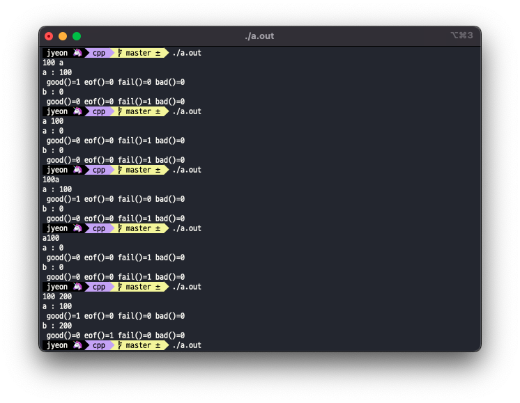

# 🌟 CPP Module 00

과제를 하면서 공부한 내용들

## 🌸 Namespaces

### 🌱 참고

- [C++ 트레이닝 책 참고](https://www.hanbit.co.kr/store/books/look.php?p_code=B7818919239)

명칭 충돌의 가능성을 피하기 위한 장치. 명칭 작성의 자유가 있고 명칭에 대한 중앙 통제 센터가 없기 때문에 같은 이름을 가진 것들이 발생해도 관리할 수 있는 방법이 없다. 언어 차원에서 이런 명칭 충돌 문제를 해결하기 위해서 네임스페이스라는 개념을 사용하게 되었다.

Namespace : 명칭이 저장되는 영역 (이름을 담는 통)

```cpp
namespace 이름
{
  이 네임스페이스 안에서 사용할 변수나 함수를 선언한다.
}
```

네임스페이스를 별도로 선언하지 않더라도 함수 바깥의 전역 네임스페이스는 항상 존재한다.

네임스페이스에 속한 명칭을 사용할 때에는 `::` 연산자 앞에 그 명칭의 소속 네임스페이스를 밝히면 된다. (`std::string` 이런 식으로)

---

`using namespace` : CPP Module 과제에서는 사용 불가

현재 영역에서 항상 std namespace의 내용을 쓴다고 했을 때 매번 `std::`를 명칭 앞에 붙여주면 가독성이 썩 좋지 않다. 이 때 지정한 네임스페이스의 모든 명칭을 현재 영역으로 가져와 `::` 연산자로 소속을 밝히지 않고도 명칭을 사용할 수 있게 하는 `using` 지시자를 사용할 수 있다.

`using` 지시자는 이 선언이 있는 **영역**에 효력을 발휘한다.

namespace라는 것을 사용하는 이유가 명칭의 소속을 분명히 해서 명칭 충돌을 막기 위해서인데 using 지시자를 사용하게 되면 namespace의 순기능이 흐려지게 된다. → 왠만하면 불편하지 않은 선에서 `using` 지시자를 적당하게 사용해야 하고, 무엇보다 우리 과제에서는 사용하면 안된다.

## 🌸 Class

### 🌱 참고

- [C++ 트레이닝 책 참고](https://www.hanbit.co.kr/store/books/look.php?p_code=B7818919239)

### 🌱 member function

구조체에 포함된 함수를 멤버 함수라고 한다.

C에서 구조체에 함수를 넣고 싶을 때에는 함수 포인터를 넣는 방식으로 구조체에 함수를 포함시킬 수 있었는데 C++에서는 함수 그대로를 구조체의 멤버로 넣을 수 있다.

```cpp
struct Info
{
  char	name[10];
  int	age;
  void selfIntroduce()
  {
    std::cout << "My name is " << name << ". I'm " << age << " years old." << std::endl;
  }
};

int main()
{
  Info penguin = {"pingu", 43};
  penguin.selfIntroduce();
  return (0);
}
```

- 멤버 함수 내에서 같은 소속의 멤버 변수에 접근할 때에는 따로 소속을 명시해 줄 필요가 없다.
- main에서 멤버 함수를 호출할 때에는 멤버 변수에 접근하듯이 `[소속 구조체].[멤버 함수]` 이런 식으로 호출해주면 된다.

```cpp
struct Info
{
  char	name[10];
  int	age;
  void selfIntroduce();
};

void Info::selfIntroduce()
{
	std::cout << "My name is " << name << ". I'm " << age << " years old." << std::endl;
}

int main()
{
  Info penguin = {"pingu", 43};
  penguin.selfIntroduce();
  return (0);
}
```

이렇게 구조체 밖에서 함수를 정의하는 것도 가능하다. 일반 함수 선언과 방식은 동일하지만 함수의 이름 앞에 `::` 연산자를 붙여서 소속 구조체를 밝혀줘야 한다.

- 구조체 내에 함수를 정의하게 되면 인라인 속성을 가지게 된다. 따라서 실제로 함수가 호출되는 것이 아니라 멤버 함수를 호출하는 코드가 함수의 본체 코드와 대체되게 된다. (위의 예제를 예로 들면 `penguin.selfIntroduce();` 이 라인이 `std::cout << "My name is " << name << ". I'm " << age << " years old." << std::endl;` 이렇게 바뀐다는 것) 이렇게 되면 함수의 호출에 대한 부담이 사라져 시간이 빨라지지만 자주 호출하게 되면 실행 파일이 커지게 된다. 따라서 멤버 함수의 코드가 아주 짧을 경우에는 인라인으로 정의하는 것이 유리하다.
- 구조체 외부에 정의하게 되면 일반적인 함수 호출처럼 멤버 함수를 호출한다.
- CPP Module 과제에서는 헤더에 함수를 정의하는 것을 엄격하게 금지하고 있다. (0점사유...)

### 🌱 액세스 지정자

액세스 지정자를 사용해서 구조체 외부에서 구조체 멤버에 접근할 수 있는 권한을 설정할 수 있다.

- `private` : 내부적으로만 사용하는 멤버, 외부에서 읽고 쓰는것이 모두 안된다.
- `public` : 외부에서 자유롭게 사용 할 수 있는 멤버
- `protected` : 자식 클래스만 자유롭게 접근 할 수 있는 멤버

```cpp
struct Info
{
  private:
  	char	name[10];
  	int	age;
  public:
  	void selfIntroduce();
};

void Info::selfIntroduce()
{
 std::cout << "My name is " << name << ". I'm " << age << " years old." << std::endl;
}

int main()
{
  Info penguin = {"pingu", 43};
  penguin.age = 34;	//	에러 발생
  penguin.selfIntroduce();	// public이므로 가능
  return (0);
}
```

private으로 지정한 멤버들에 외부에서 직접적으로 접근하려 하면 에러가 발생한다. 따라서 public에다가 private 멤버 변수들에 접근할 수 있는 함수들을 선언해두는데 이런 함수들을 액세서(Accessor)라고 한다. (get / set 함수들)

### 🌱 class

함수를 포함할 수 있는 C++의 확장된 구조체를 Class라고 한다.

확장된 구조체를 struct 키워드로 선언했을 경우에는 기본 액세스 지정자가 public이지만 class 키워드로 선언했을 경우에는 기본 액세스 지정자가 private이라는 차이점이 있다.

클래스도 타입과 동등한 자격을 가져서 기본 자료형과 거의 동일하게 포인터 연산, 배열 같은 것들을 사용하고 선언할 수 있다.

### 🌱 인스턴스

아주 간단하게 말하면 어떤 class 타입의 변수. 실제로 메모리에 구현된 그것을 말한다. 객체라고도 한다.

인스턴스의 크기는 클래스 내의 멤버변수 크기의 총합과 같다.

### 🌱 생성자

변수를 생성하듯 클래스의 인스턴스를 생성하면 그 안의 멤버변수들의 값에는 쓰레기값이 들어가기 때문에 당연하게도 그 멤버변수를 초기화하는 작업이 필요할 것이다. 이 선언과 멤버변수 초기화 작업을 동시에 하기 위해서 **생성자**라는 함수를 사용한다.

생성자는 컴파일러가 자동으로 호출하기 때문에 클래스와 이름이 같고 별도의 반환값이 필요하지 않기 때문에 반환형이 없다는 특징이 있다.

생성자 역시 함수이기 때문에 인수를 받아서 그 값으로 멤버변수를 초기화 할 수 있다. 인수 목록을 다르게 해서 다른 방식으로 생성자를 만들 수도 있다! (생성자 오버로딩)

### 🌱 소멸자

생성자로 생성한 인스턴스가 생성되기 전 상태로 돌려놓는 함수가 소멸자. 소멸자의 이름은 `~클래스명` 으로 정해져 있다.

생성자와 소멸자 모두 기본 생성자/소멸자가 있어서 정의하지 않으면 멤버변수를 초기화하지 않는 생성자와 소멸자를 컴파일러가 알아서 만든다.

## 🌸 입출력 스트림

### 🌱 참고

- [C++ 트레이닝 책 참고](https://www.hanbit.co.kr/store/books/look.php?p_code=B7818919239)
- <https://www.geeksforgeeks.org/c-stream-classes-structure/>
- <https://cplusplus.com/reference/istream/istream/operator%3E%3E/>
- <https://cplusplus.com/reference/ostream/ostream/operator%3C%3C/>
- <https://cplusplus.com/reference/string/basic_string/operator%3E%3E/>
- <https://cplusplus.com/reference/string/basic_string/operator%3C%3C/>

### 🌱 구조


### 🌱 <<, >> 연산자

기본 타입에 대한 <<, >> 함수가 모두 정의되어 있고, 출력 후 자기 자신을 다시 리턴해서 `cout << "hello" << " world";` 이런 식으로 쓸 수 있다.

### 🌱 출력 스트림

표준 출력 객체 : cout

<< 연산자로 데이터를 보내서 출력한다. 기본 타입에 대해서 오버로딩되어있기 때문에 타입 상관없이 그냥 보내면 알아서 맞는 타입으로 출력해준다.

### 🌱 입력 스트림

표준 입력 객체 : cin

키보드의 입력을 >> 연산자로 cin 객체로 보낸다. 역시 기본 타입에 대해서 오버로딩되어있기 대문에 타입에 상관없이 알아서 맞는 타입으로 넣어준다.

- 공백은 기본적으로 구분자로 취급된다. 따라서 공백을 입력받을 수 없다.
- 무효한 입력을 만나면 즉시 입력을 중지한다. (정수는 숫자만 입력, 문자열은 공백에서 입력을 끊어버림)
- 읽지 못한 데이터는 버퍼에 남겨져서 다음 입력때 읽힌다. → 만약에 어떤 이유로 읽히지 못한 데이터가 있을 경우에는 버퍼를 비워줘야 한다.

입력 스트림의 에러 플래그

- failbit : 입력에 실패했을 경우 on (예: 정수를 입력받아야 하는데 문자가 입력된 경우)
- eofbit : EOF에 도달한 경우 on
- badbit : 스트림이 물리적으로 손상된 경우 on. 더 이상 읽을 수 없다.
- goodbit : 위의 세 비트가 on 되지 않은 경우 on. 일단 0으로 정의되어 있다.

위 4개의 플래그의 상태는 `fail()`, `eof()`, `bad()`, `good()` 함수로 확인할 수 있다.

## 🌸 initialization list

### 🌱 참고

- [C++ 트레이닝 책 참고](https://www.hanbit.co.kr/store/books/look.php?p_code=B7818919239)

생성자의 주 역할은 멤버 변수를 초기화하는 것. 그 일을 리스트로 간편하게 할 수 있는 것이 **initialization list** 이다.

```cpp
Account::Account( int initial_deposit ) : _accountIndex(_nbAccounts++), _amount(initial_deposit), _nbDeposits(0), _nbWithdrawals(0)
{
	_displayTimestamp();
	_totalAmount += initial_deposit;
	std::cout << "index:" << _accountIndex << ";";
	std::cout << "amount:" << _amount << ";";
	std::cout << "created\n";
}
```

이런 식으로 makefile의 defendency 처럼 : 오른쪽에 `멤버변수(초기화할 값)` 형식으로 표시한다.

쓸땐 편하긴 한데 가독성이 좀 떨어진다는 단점은 있다. Body가 시작되기 전에 (그러니까 쓰레기값이 담긴 멤버변수가 생성되기 전에) 멤버변수에 값을 할당하기 때문에 선언과 동시에 초기화하는 것과 비슷하다고 생각하고 있다.

```cpp
std::string str1;
str1 = "C++";

std::string str2 = "kkuljaem";
```

이런 차이? 그렇기 때문에 먼저 쓰레기값을 가지고 나중에 값을 변경할 수 없는, 혹은 애초에 쓰레기값을 값으로 가질 수 없는 멤버변수의 경우에는 이렇게 초기화 리스트를 사용하는 것이 필수적이다.

```cpp
class Some
{
  public:
		const int sangsu;
		int &ref;
}
```

이런 식으로 상수나, 레퍼런스 변수의 경우에는 초기화리스트로 생성과 동시에 멤버변수들을 초기화해줘야 한다. (정확한 동작 원리는 모르겠지만 리스트로 초기화시킬 값을 넘겨주면 `std::string str2 = "kkuljaem";` 이런 식으로 내부적으로 동작하지 않을까? 하는 생각이 든다. (뇌피셜!))

## 🌸 static (정적 멤버)

### 🌱 참고

- [C++ 트레이닝 책 참고](https://www.hanbit.co.kr/store/books/look.php?p_code=B7818919239)

### 🌱 this

객체가 여러 개 있을 때 멤버 변수는 객체별로 따로 갖고 멤버 함수는 여러 객체들이 공유한다.

여러 객체들이 함수를 공유하는 것이기 때문에 함수 내에서 멤버 변수를 접근할 때에는 기본적으로 그 함수를 호출한 객체 자신을 참조하게 된다. 이때 그 함수를 호출한 객체 자신의 포인터가 `this` 인수이다.

멤버 함수 내에서 클래스의 멤버를 참조하는 모든 문장 앞에 `this->`가 암시적으로 적용된다.

암시적으로 적용되는 것이기 때문에 크게 신경쓸 필요는 없지만 함수 내에서 호출한 객체 자신을 칭해야 하는 경우 (다른 객체를 인자로 받는다거나) 혹은 지역변수와 멤버변수의 이름이 충돌할 경우에는 this 인수를 사용해줘야 한다.

### 🌱 정적 멤버 변수

정의 : 클래스에 소속되는 변수이지만 객체별로 할당되지 않고 모든 객체가 공유한다.

필요성? : 객체들이 모두 공유해야 하는 변수가 필요하다고 했을 때 단순히 전역변수로 그 변수를 선언했을 경우에는 객체지향이 지향하는 바와 맞지 않게 된다.

- 클래스와 관련된 정보가 외부에 선언됨 → 캡슐화 위반
- 전역변수는 접근 지정을 할 수 없기 때문에 외부에서 자유롭게 쓰거나 읽을 수 있다. → 정보 은폐가 안됨.

그래서 클래스 안에서 staic 키워드를 붙여서 정적 멤버임을 명시하고, 이 정적 멤버 변수는 클래스 밖에서 :: 키워드로 소속을 밝힌 뒤, 초기화해서 사용한다.

```cpp
// Account.hpp
class Account {
private:
	static int	_nbAccounts;
	static int	_totalAmount;
	static int	_totalNbDeposits;
	static int	_totalNbWithdrawals;
};

// Account.cpp
int	Account::_nbAccounts = 0;
int	Account::_totalAmount = 0;
int	Account::_totalNbDeposits = 0;
int	Account::_totalNbWithdrawals = 0;
```

이런 식으로 초기화한다. 그냥 공유 멤버라고 하는 편이 좀 더 이해하기 편할 듯?

이렇게 선언된 정적 멤버 변수는 객체가 생성되기 전에 먼저 생성되고, 객체가 생성될때마다 각 객체의 정적 멤버가 아닌 변수들만 새로 할당된다.

접근 지정도 일반 멤버 변수와 동일하게 할 수 있다. (private, public)

### 🌱 정적 멤버 함수

정적 멤버 함수의 적용 대상은 모든 객체이다. 모든 객체에 공통적인 작업을 처리해야 할 때 정적 멤버 함수를 정의하는 것 같다. ~~(잘 모르겠음..)~~

정적 멤버 함수에는 객체가 전달되지 않는다. (당연함. 적용 대상이 모든 객체이기 때문에?) 그래서 정적 멤버 함수에서는 정적 멤버 변수에만 접근할 수 있다.

그렇기 때문에 생성된 객체가 없더라도 정적 멤버 함수는 호출할 수 있다. (정적 멤버 변수는 최초의 객체 생성 전에도 존재하기 때문에)

정적 멤버 함수는 정적 멤버 변수에 어떤 액션을 취해야 할 때 사용하는 것 같다?!

## 🌸 const (상수 멤버)

### 🌱 참고

- [C++ 트레이닝 책 참고](https://www.hanbit.co.kr/store/books/look.php?p_code=B7818919239)

### 🌱 상수 멤버 변수

값이 결정되면 변경할 수 없는 멤버. 멤버 선언 앞에 const 지정자를 붙여서 상수 멤버를 선언한다.

```cpp
class Circle
{
	private:
		const double pi;
		int radius;
};
```

각각의 개체가 상수 멤버를 따로 가지기 때문에 객체별로 상수 멤버의 값이 달라도 상관없다. (실행 중에 변하지만 않으면 된다.)

열거형을 사용하는 방식도 있긴 한데 열거형은 객체 지향과 어울리지 않는다는 점에 유의하자. (왜?)

### 🌱 상수 멤버 함수

상수 멤버 함수는 객체의 상태를 읽기만 하는 함수이다.

선언한 함수가 객체의 상태를 변경하지 않고 읽기만 한다면 함수명 뒤에 const 지정자를 붙여준다.

만약에 상수 객체를 선언했다면, 그 객체는 내부의 멤버 변수들의 값을 변경할 수 없다. 따라서 상수 객체는 오직 상수 멤버 함수만 호출할 수 있다.

## 🌸 General rules

### 🌱 참고

- [C++ 트레이닝 책 참고](https://www.hanbit.co.kr/store/books/look.php?p_code=B7818919239)

- <https://en.wikipedia.org/wiki/Pragma_once>
- <https://kldp.org/node/46662>
- <https://caniro.tistory.com/24>
- <http://doc.kldp.org/KoreanDoc/html/GNU-Make/GNU-Make-4.html>

### 🌱 friend

객체의 신뢰성 향상을 위해서 정보 은폐를 엄격히 지키라고는 하지만 엄격한 은폐는 불편할 때가 있기 때문에 예외를 두어서 특정 대상에 대해서는 모든 멤버를 공개할 수 있게 하는데 이거를 프렌드 지정이라고 한다. 

우리 과제에서는 사용하면 0점임

#### 프렌드 함수 (전역 함수)

클래스 밖의 전역 함수를 frend로 지정할 수 있다. 이렇게 friend로 지정된 함수는 클래스 밖의 함수이기 때문에 클래스의 멤버 함수는 아니지만 클래스의 모든 멤버에 자유롭게 접근할 수 있는 특권이 주어진다.

#### 프렌드 클래스

두 개의 클래스가 밀접한 관계 / 상대편을 참조해야 하는 일이 많다면 클래스를 통째로 프렌드로 지정해도 된다. 클래스 선언문에 friend 키워드를 붙이고 클래스 이름을 밝혀주면 해당 클래스는 우리 클래스의 모든 멤버에 자유롭게 접근할 수 있다.

#### 프렌드 멤버함수

특정 클래스의 멤버 함수만 프렌드로 지정할 수 있다. ... 방법과 개념은 위와 비슷하다. 프렌드 클래스를 지정했을 때 권한이 너무 크기 때문에 조금 좁은 범위의 권한을 주는 느낌.

암튼 쓰면 안된다.

### 🌱 #pragma once

헤더의 중복 인클루드를 방지하기 위해서 사용하는 전처리기

기존에 사용하고 있던 include guards (`ifndef`) 는 한번 읽었던 헤더파일도 일단 다시 읽어봐야 하지만 `#pragma once`는 각 파일별로 프리프로세서(컴파일러)가 앞서 include 했음을 기억하면 되므로 이후에 동일한 헤더파일이 등장했을 때 include guards와 달리 다시 읽어보지 않아도 된다. → 그래서 `#pragma once`를 사용하게 되면 컴파일 시간이 단축된다는 장점이 있다.

근데 `#pragma once`는 표준이 아니기 때문에 컴파일러에서 `#pragma once`를 지원하는지를 먼저 알아봐야 하고 (c/c++/gcc에서는 `#pragma once`를 지원하긴 한다.) 경로가 다르지만 동일한 파일을 가리킨다거나 해서 (hard link, soft link 등) 오류가 발생할 수도 있다.

ex02의 Account.hpp에서 `#pragma once`를 사용해서 찾아본건데 우리 과제에서는 파일의 양이 많지 않기 때문에 굳이 비표준인 `#pragma once`를 사용할 필요는 없어보인다...

### 🌱 Makefile

```makefile
CC = cc
NAME = minishell
CFLAGS	=	-Wall -Wextra -Werror
```

```makefile
NAME	=	megaphone
CXX	=	c++
CXXFLAGS	=	-std=c++98 -pedantic -Wall -Wextra -Werror
```

makefile에 대해선 좀 더 공부해봐야 할 것 같다.. 공부 좀 더 해서 TIL에 정리해야지.

아무튼 c++ 플래그는 CXXFLAGS고 c++ 컴파일러는 CXX이다. 그래서 원래 쓰던대로 CFLAGS를 사용하면 실제로 적용이 되지 않는 문제가 있다고 한다. (암묵적 / 묵시적 규칙. C++ 파일을 컴파일할때는 기본적으로 CXX 와 CXXFLAGS를 찾아서 컴파일한다.)

<http://doc.kldp.org/KoreanDoc/html/GNU-Make/GNU-Make-4.html>

## 🌸 ex00

### 🌱 참고

- [C++ 트레이닝 책 참고](https://www.hanbit.co.kr/store/books/look.php?p_code=B7818919239)
- <https://cplusplus.com/reference/string/basic_string/>
- <https://cplusplus.com/reference/iterator/>
- <https://ko.wikipedia.org/wiki/%EB%B0%98%EB%B3%B5%EC%9E%90>
- <https://cplusplus.com/reference/cctype/toupper/?kw=toupper>
- <https://yechoi.tistory.com/48>

### 🌱 std::string

#### 문자열 클래스

기본적으론 C와 동일하게 배열로 문자의 집합을 표현하는 방식으로 문자열을 표현한다. 여기서 발전해서 Class를 이용해서 보다 편하게 문자열을 타입으로 사용할 수 있게 했다.

std namespace에 정의되어 있고 string 헤더파일에 선언되어 있다. 

```cpp
typedef basic_string<char, char_traits<char>, allocator<char> > string;
```

클래스 템플릿으로 선언되어있는 basic_string으로 만든 string 클래스. 자세한건 나중에 템플릿 공부하면서 다시 보자.

클래스이기 때문에 다양한 방법으로 문자열 객체를 생성할 수 있다.

```cpp
#include <string>

std::string s1("string 1");	// s1 = "string 1"
std::string s2(s1);	// s2 = "string 1"
std::string s3;	// s3 = 
char *str = "hello world";
std::string s4(str, str + 5);	//s4 = "hello"
```

문자열 객체는 범위를 벗어날 때 소멸자가 메모리를 자동으로 정리한다.

주의해야 하는 것인지는 모르겠지만 basic_string 템플릿은 다양한 형태의 문자열을 제공하기 때문에 string 이 항상 널 종료 문자열이라고는 할 수 없다.

#### 입출력

string 헤더 파일에 cout 과 cin에 대해서 << 연산자와 >> 연산자가 모두 오버로딩 되어있어 기본 자료형처럼 입출력받을 수 있다.

문자열의 개별 문자에 접근할 때에는 at 함수나 배열의 인덱스처럼 접근할 수 있다. 나는 그냥 배열의 인덱스처럼 접근하려고 한다. (at 함수를 이용하면 범위를 벗어난 접근을 시도했을 때 예외를 발생시켜서 좀 더 안전하다.)

이렇게 접근한 문자는 상수 문자열이 아닌 이상 변경도 가능하다.

### 🌱 iterator

반복자. 배열과 같이 연속적으로 저장되어있는 자료구조의 각각의 요소에 반복적으로 접근할 수 있게 해 주는 객체. 아무튼 컨테이너에 저장되어 있는 요소에 순차적으로 접근할 수 있게 해 주는 객체이다.

C++에서는 다양한 컨테이너를 제공하는데 (문자열, vector, list, map, set...) 이 컨테이너의 종류에 상관 없이 특정 객체에 접근할 수 있는 함수가 있으면 편리하다! 해서 만들어진 클래스가 iterator고 ... 그냥 좀 더 편리하게 사용할 수 있게 만든 포인터 클래스라고 생각하고 있다.

08과제 까지는 STL 컨테이너를 쓰지 못하기 때문에 ... string 같은데서나 iterator를 사용할 수 있을 듯 하다.

[cplusplus의 예시 코드](https://m.cplusplus.com/reference/string/string/begin/) 를 보면 진짜 포인터랑 비슷한 방식이구나.. 하고 알 수 있다.

```cpp
// string::begin/end
#include <iostream>
#include <string>

int main ()
{
  std::string str ("Test string");
  for ( std::string::iterator it=str.begin(); it!=str.end(); ++it)
    std::cout << *it;
  std::cout << '\n';

  return 0;
}
```

- str.begin() : string의 첫번째 문자를 가리키는 이터레이터를 반환한다.
- str.end() : string의 *past-the-end* 문자를 가리키는 이터레이터를 반환한다. 여기서 *past-the-end* 문자라는 것은 string의 마지막 문자 바로 뒤의 문자를 의미한다. (theoretical character that would follow the last character in the string.) 어쨌든 string에 포함되는 영역이 아니기 때문에 iterator가 str.end()이 아닐 때까지 반복문을 돌려주면 string의 문자에 순차적으로 접근할 수 있다.


가능한 iterator 연산자들. 증감연산자로 다음 요소에 접근할 수 있다.

### 🌱 std::toupper

```cpp
int toupper ( int c );
```

**Convert lowercase letter to uppercase**

반환값은 char로 암묵적으로 캐스팅 될 수 있는 int 값이다. 걍 넣어주면 된다는 뜻.

참고로 : <https://cplusplus.com/reference/locale/toupper/> (아직 이해가 잘 안되어서 사용하지는 못했음.)

### 🌱 std::endl

입출력 매니퓰레이터 중 하나. 스트림에 개행문자를 넘겨주는 동시에 출력 버퍼를 비운다.

## 🌸 ex01

### 🌱 참고

- [C++ 트레이닝 책 참고](https://www.hanbit.co.kr/store/books/look.php?p_code=B7818919239)
- [전문가를 위한 C++ 책 참고](https://www.hanbit.co.kr/media/books/book_view.html?p_code=B3215427289)
- <https://m.cplusplus.com/reference/sstream/stringstream/>
- <https://stackoverflow.com/questions/24504582/how-to-test-whether-stringstream-operator-has-parsed-a-bad-type-and-skip-it>
- <https://cplusplus.com/reference/string/string/getline/?kw=getline>

### 🌱 std::getline

cin 객체는 공백을 기준으로 입력을 받지만, getline 객체는 기본적으로 개행문자를 구분자로 입력을 받는다.

```cpp
#include <string>
istream& getline (istream& is, string& str, char delim);
istream& getline (istream& is, string& str);
```

getline은 구분자 입력 뒤에 구분자를 버퍼에서 제거하지만, cin은 개행문자를 버퍼에 그냥 둔다는 점을 기억해서 버퍼 관리를 해 주도록 하자.

### 🌱 iomanip

IO Manipulators 가 모여있는 헤더파일. 매니퓰레이터 객체를 스트림에 넘겨서 입출력 스트림의 동작을 조정할 수 있다.

#### setw

```cpp
std::cout << std::setw(10) << "hello";
```

최소 출력 폭을 고정한다. 일시적인 효과를 주기 때문에 매번 출력 전에 출력 스트림에 넘겨줘야 한다.

### 🌱 string stream

string에 스트림 개념을 추가한 것이다. 파일 입출력처럼 string 객체로부터 입력받고, string객체에 출력하는 것이다.

기본적으로 토큰화 기능을 제공하기 때문에 파싱도 간단하게 할 수 있다.

(istringstream 기준으로) 입력받은 string을 공백을 기준으로 자르고, 앞에서부터 차례대로 >> 오른쪽 변수의 자료형과 맞는 값을 찾아온다.

```cpp
#include <iostream>
#include <string>
#include <sstream>

void print_state (const std::ios& stream) {
  std::cout << " good()=" << stream.good();
  std::cout << " eof()=" << stream.eof();
  std::cout << " fail()=" << stream.fail();
  std::cout << " bad()=" << stream.bad() << std::endl;
}

int main()
{
  std::string input_str;
  std::getline(std::cin, input_str);
  std::stringstream ss(input_str);
  int a, b;
  ss >> a;
  std::cout << "a : " << a << '\n';
  print_state(ss);
  ss.clear();
  ss >> b;
  std::cout << "b : " << b << '\n';
  print_state(ss);
  return (0);
}
```

stringstream의 파싱이 어떻게 되는 것인지 궁금해서 테스트를 좀 해봤는데 흔히(?) 알려진 단순히 공백을 구분자로 자르는 식으로 파싱이 되는게 아닌 것 같다;



가장 첫번째로 보이는 값이 int형이면 int형의 끝까지 받아오는 것 같다. 그리고 그 입력이 성공하면 다음 입력을 받아오는 것 같고, 그 입력이 실패하면 다음 입력으로 넘어가지 않는 것 같다.

스택오버플로우 답변을 보니까 잘못 읽은 것을 무시하기 위해서는 또 별도의 작업이 필요한 듯 한데 이 과제에서는 일단 첫번째 입력값만 확인해보면 되므로 나중에... 필요하면 찾아보는 걸로 하자...

### 🌱 오버로딩

같은 이름의 변수를 두 개 선언할 수는 없지만 함수는 파라미터가 다르면 같은 이름으로 중복으로 정의가 가능하다. 이걸 함수의 오버로딩이라고 한다.

파라미터의 목록을 보고 함수 구분이 가능하면 오버로딩이 가능한것이다. 반환 타입만 다른 경우에는 오버로딩이 불가능함! (어떤 함수를 "호출" 하는지가 문제기 때문에 반환 타입은 고려 요소가 아니다.)

## 🌸 ex02

### 🌱 참고

- <https://m.cplusplus.com/reference/ctime/time/>
- <https://m.cplusplus.com/reference/ctime/localtime/>
- <https://m.cplusplus.com/reference/ctime/strftime/?kw=strftime>
- <https://skuld2000.tistory.com/137>
- <https://m.cplusplus.com/reference/ctime/tm/>

### 🌱 Timestamp 찍기

#### time 함수

현재 시간을 받아오는 함수이다. 

```cpp
time_t time (time_t* timer);
```

`time_t` 변수의 포인터를 넘겨주면, 1970년 1월 1일 0시 0분 부터 현재까지의 시간을 초 단위로 카운트해서 넘겨준다. `time_t`는 그냥 정수형 타입이다.

#### localtime 함수

`time_t` 타입의 값을 `tm` 구조체 타입으로 바꾸어준다.

```cpp
struct tm * localtime (const time_t * timer);
```

`time` 함수로 받아온 `time_t` 값은 초 단위이기 때문에 사용의 편의를 위해서 `tm` 구조체로 바꾸어주는 것이 좋다. 

```cpp
struct tm {
	int	tm_sec;		/* seconds after the minute [0-60] */
	int	tm_min;		/* minutes after the hour [0-59] */
	int	tm_hour;	/* hours since midnight [0-23] */
	int	tm_mday;	/* day of the month [1-31] */
	int	tm_mon;		/* months since January [0-11] */
	int	tm_year;	/* years since 1900 */
	int	tm_wday;	/* days since Sunday [0-6] */
	int	tm_yday;	/* days since January 1 [0-365] */
	int	tm_isdst;	/* Daylight Savings Time flag */
	long	tm_gmtoff;	/* offset from UTC in seconds */
	char	*tm_zone;	/* timezone abbreviation */
};
```

이런 식으로 변환되어서 필요에 따라서 골라서 쓸 수 있다.

#### strftime 함수

`tm` 구조체의 내용을 `format`대로 만들어서 char형 배열로 만들어주는 함수이다.

```cpp
size_t strftime (char* ptr, size_t maxsize, const char* format, const struct tm* timeptr );
```

- `ptr` : `format`대로 만들어진 문자열을 저장할 `char`형 배열을 가리키는 포인터
- `maxsize` : `null` 문자를 포함한 `ptr`에 들어갈 문자의 개수
- `format` : `ptr`에 들어갈 문자열의 포맷을 지정한다. `printf` 의 `format` 인자처럼 사용하면 된다.
  - `%Y` : 년 (4자리 숫자)
  - `%m` : 월 (2자리 숫자)
  - `%d` : 일 (2자리 숫자)
  - `%H` : 시 (2자리 숫자, 24시간 포맷)
  - `%M` : 분 (2자리 숫자)
  - `%S` : 초 (2자리 숫자)

- `timeptr` : `format`대로 출력해줄 `tm` 구조체 포인터

### 🌱 Vector 생성자

https://cplusplus.com/reference/vector/vector/vector/

이 문제에서는 **range constructor** 를 사용했다.
