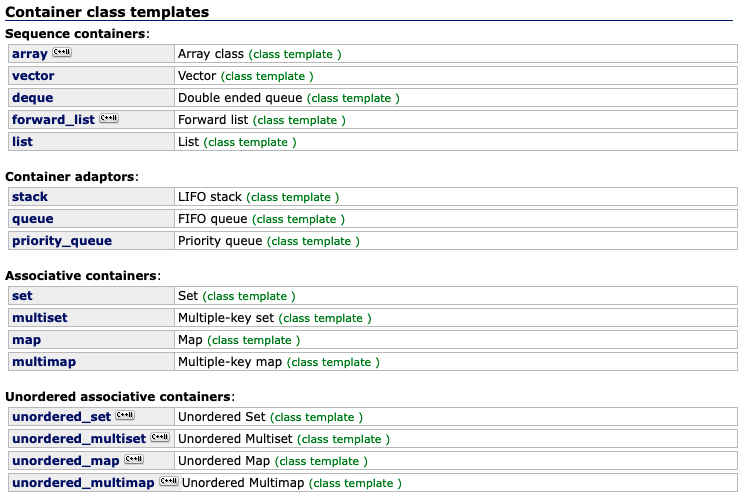
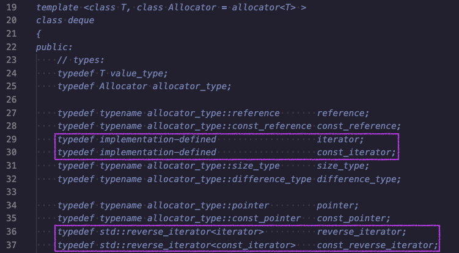
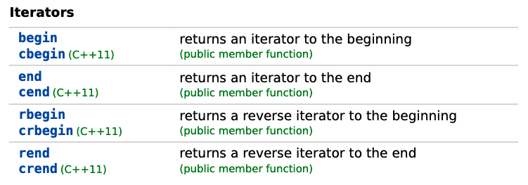

# 🌟 CPP Module 08

과제를 하면서 공부한 내용들(을 엄청 대충 정리함)

## 🌸 STL (Standard Template Library)

이번 과제는 가능하면 STL을 잘 활용해야 하는 문제이다. 정리를 잘 하고 싶은데 아주 간결하고 깔끔하게 정리를 잘 해 두신 글이 있어서 그 글 링크로 대체한다. (힘들거나 귀찮아서 그런거 아님...)

https://blockdmask.tistory.com/67

## 🌸 Iterator

표준 라이브러리에서 컨테이너의 원소에 접근하는 기능을 **범용적으로** 제공하기 위해서 반복자 패턴을 사용한다. 컨테이너마다 원소에 대해서 반복문을 수행할 방법이 담긴 포인터인 반복자가 정의되어 있다. (포인터라곤 했지만 사실 컨테이너에 따라서 포인터로 구현된 것도 있고, 아닌 경우도 있다.) 

반복자의 인터페이스는 c++ 표준을 따르기 때문에 공통적으로 사용할 수 있다.

컨테이너의 특정 원소의 포인터로 생각할 수 있다. 따라서 ++연산을 하면 다음 원소로 이동할 수 있고, (-- 연산으로 역방향으로 이동하는 것은 일부 반복자만 가능한 것 같다.) 반복자를 이용해서 원소 자체에 접근할 때 \* 또는 -> 이렇게 접근할 수도 있다.

순차 컨테이너, 연관 컨테이너, 비정렬 연관 컨테이너에서만 반복자를 제공한다. (컨테이너 어댑터와 bitset에서는 원소에 대한 반복자를 제공하지 않는다.)

반복자를 지원하는 표준 라이브러리 컨테이너 클래스는 모두 반복자 타입에 대해 public 타입 앨리어스 (typedef)인 iterator와 const_iterator를 제공한다. (아래 deque 헤더 부분 정리한 것에서도 볼 수 있다.) 따라서 int 타입 원소에 대한 vector의 반복자의 타입은 `std::vector<int>::iterator` 이다. (참고: const_iterator는 컨테이너의 원소를 읽기 전용으로 접근하는 반복자이다.)

컨테이너는 반복자를 리턴하는 begin() 과 end() 메소드를 제공하는데 begin() 첫 번째 항목을 참조하는 반복자를 리턴하고, end() 는 마지막 항목의 바로 다음 원소에 해당하는 지점을 가리키는 반복자를 리턴한다. (반개방 범위) 이렇게 한 이유는 비어있는 구간을 지원하기 위해서인데, 비어있다면 begin과 end 가 반환하는 값이 같다.

지금은 너무 깊게 공부할 여유가 없어서 그냥 링크만 넣어 두지만, 읽어보면 재밌을 것 같다.

- <https://m.cplusplus.com/reference/iterator/RandomAccessIterator/>
- <https://m.cplusplus.com/reference/iterator/BidirectionalIterator/>

앞으로 정리할 컨테이너에서 사용하는 반복자를 정리해보면 아래와 같다.

- Random-access iterator : vector, deque
- Bidirectional iterator : list
- iterator 없음 : stack, queue, priority_queue

이름만 봐도 대충 감이 오겠지만, Random-access iterator 는 임의로 접근이 가능하기 때문에 서로 다른 이터레이터들끼리 사칙연산 포함 다양한 연산을 지원하지만, Bidirectional iterator는 단 두가지 뱡향만 있기 때문에 앞으로 한칸 (증가연산), 뒤로 한칸(감소 연산) 밖에 이동 방법이 없다. 사칙연산이 안되기 때문에 직접 1을 더하는 것도 불가능함.

### 🌱 std::distance

<https://m.cplusplus.com/reference/iterator/distance/>

```cpp
template<class InputIterator>
  typename iterator_traits<InputIterator>::difference_type
    distance (InputIterator first, InputIterator last);
```

iterator first부터 last까지의 **거리**를 구하는 함수이다. [first, end) 구간 사이에 있는 원소의 개수와도 같은 말이다.

random access iterator가 인자로 들어왔을 경우에는 - 연산자를 사용해서 계산하고, 그 외의 경우에는 ++ 연산자를 사용해서 last와 동일한 값이 나올 때까지 증가시키는 방법으로 계산한다.

## 🌸 algorithm

Module 07까지는 algorithm 헤더의 사용을 엄격하게 금지했지만, 08부터는 갑자기 가능하면 algorithm을 포함한 stl을 많이 쓰라고 한다. (안쓰면 fail임...;;)

하루만에 다 공부하는 것은 당연히 어렵고, 이번 과제에서 내가 사용했던 algorithm 헤더의 함수만 좀 정리해보려고 한다.

### 🌱 참고

- <https://m.cplusplus.com/reference/algorithm/>
- <https://en.cppreference.com/w/cpp/algorithm>

### 🌱 std::find

<https://m.cplusplus.com/reference/algorithm/find/>

```cpp
template <class InputIterator, class T>
   InputIterator find (InputIterator first, InputIterator last, const T& val);
```

first부터, last 바로 앞 원소 까지의 범위에서 (반개방 범위) val과 일치하는 값을 찾는다. 만약에 찾는 값이 없으면 last를 return하고, 찾은 경우에는 val을 가리키는 InputIterator를 반환한다.

```cpp
template<class InputIterator, class T>
  InputIterator find (InputIterator first, InputIterator last, const T& val)
{
  while (first!=last) {
    if (*first==val) return first;
    ++first;
  }
  return last;
}
```

### std::sort

<https://m.cplusplus.com/reference/algorithm/sort/>

```cpp
template <class RandomAccessIterator>
  void sort (RandomAccessIterator first, RandomAccessIterator last);
template <class RandomAccessIterator, class Compare>
  void sort (RandomAccessIterator first, RandomAccessIterator last, Compare comp);
```

[first, last) 범위의 원소들을 정렬한다.

세번째 인자가 없으면 기본적으로 오름차순 정렬하고, 세번째 인자로 bool 타입의 값을 반환하는 비교 함수를 만들어 넣어주면 그 함수의 기준에 맞게 정렬한다.

퀵정렬로 구현되어 있기 때문에 시간복잡도는 nlogn이고, random access iterator만 인자로 받을 수 있다.

### std::min std::max

<https://m.cplusplus.com/reference/algorithm/min/>

<https://m.cplusplus.com/reference/algorithm/max/>

```cpp
template <class T> const T& min (const T& a, const T& b);
template <class T, class Compare>
  const T& min (const T& a, const T& b, Compare comp);

template <class T> const T& max (const T& a, const T& b);
template <class T, class Compare>
  const T& max (const T& a, const T& b, Compare comp);
```

인자로 들어오는 두 값을 비교해서, 각각 큰 값과 작은 값의 레퍼런스를 반환한다.

세번째 인자를 주지 않으면 일반적인 <, > 연산자를 이용해서 비교한 결과를 반환하고, sort처럼 세번째 인자에 비교 함수를 넣어주면 그 기준에 맞추어서 min, max를 반환한다.

### std::min_element, std::max_element

```cpp
template <class ForwardIterator>
  ForwardIterator min_element (ForwardIterator first, ForwardIterator last);
emplate <class ForwardIterator, class Compare>
  ForwardIterator min_element (ForwardIterator first, ForwardIterator last,
                               Compare comp);

template <class ForwardIterator>
  ForwardIterator max_element (ForwardIterator first, ForwardIterator last);
template <class ForwardIterator, class Compare>
  ForwardIterator max_element (ForwardIterator first, ForwardIterator last,
                               Compare comp);
```

[first, last) 범위 안에서 가장 큰 값과, 가장 작은 값을 가리키는 이터레이터를 반환한다. 역시 다른 함수들과 비슷하게, 비교함수를 커스텀 할 수 있다.

## 🌸 Container

컨테이너는 다양한 데이터를 묶음 단위로 저장하는 제네릭 데이터 구조이다. (클래스 템플릿) 기본 조건만 만족한다면 거의 모든 타입에 대해 인스턴스화해서 사용할 수 있다. array 나 bitset 을 제외한 표준 라이브러리 컨테이너는 크기를 조절할 수 있고, 원소를 추가하거나 삭제할 때 자동으로 크기가 늘어나거나 줄어든다. C 스타일 배열을 사용하는 것 보다 안정성 면에서 압도적으로 좋다.

프로그래밍에서 유용하게 쓰이는 동적배열, 큐, 스택, 힙, 연결리스트, 트리, 연관배열 같은 것들을 편리하게 사용하기 위해서 구현된 클래스 템플릿.



[cplusplus](https://cplusplus.com/reference/stl/) 에 있는 container 목록들 중에, C++ 11부터 추가된 컨테이너들 제외하고, Module 08에서 다루지 않는 연관 컨테이너를 제외한 vector, deque, list, stack, ~~queue, priority_queue~~ 에 대해서만 (과제에 내용과 관련된 것들만 아주 간략하게...) 정리해보기로 했다. (queue, priority_queue는 나중에 보자;; 나중에)

## 🌸 Sequence Containers

위키백과 : <https://en.wikipedia.org/wiki/Sequence_container_(C%2B%2B)>

각각의 원소들을 **순차적**으로 접근할 수 있는 컨테이너이다. 데이터들이 선형으로 저장되어 있다.

### 🌱 vector

대부분 <https://cplusplus.com/reference/vector/> 의 내용 정리 (번역..?)

vector는 메모리를 동적으로 바꿀 수 있는 배열이다. 일반 배열과 동일하게 원소들이 연속적으로 저장되어 있고, 원소들에 순차적으로 접근하는 것도, 인덱스로 원하는 위치에 접근하는 것도 (Random Access) 가능하다. 배열과 거의 비슷하지만 다른 큰 차이는 크기를 동적으로 바꿀 수 있다는 점이다. (메모리를 동적으로 알아서 관리한다.)

어쨌든 배열과 동일한 구조이기 때문에 vector도 내부적으로 동적으로 할당된 배열을 사용한다. 다만 매번 원소가 추가되고, 삭제될때마다 배열을 재할당해서 복사하는 방식은 오버로드가 심하기 때문에 일반적으로 원소의 개수 (`size()`) 보다 넉넉하게 공간(`capacity()`)을 할당해둔다. 그래서 직접적으로 배열을 사용하는 것 보다는 느리고, 메모리를 많이 사용한다는 단점이 있다.

다른 sequence container(deque, list)에 비해서 vector는 인덱스를 통해서 원소에 접근하는 것이 효율적이다. 하지만 원소를 끝에 삽입/삭제하는 것이 아닌 (`push_back()`, `pop_back()`) 중간에 원소를 삽입/삭제하는 것(`insert()`, `erase()`)은 다른 컨테이너들에 비해서 더 비효율적이다.

#### Member functions

##### Constructor

```cpp
#include <vector>
std::vector<int> default_vector;	// default constructor : 빈 벡터 생성
std::vector<int> fill_vector(5, 42);	// fill constructor : 5개의 42로 벡터를 채운다.
std::vector<int> range_vector(other.begin(), other.end()); // range constructor : [첫번째 인자, 두번째 인자) 범위의 원소들을 순서대로 벡터에 채워넣는다.
std::vector<int> copy_vector(other_vector); // copy constructor : 다른 벡터를 복사한다. (깊은복사)
```

기억해야 할 것은 vector의 복사 생성자 역시 깊은 복사로 새로운 벡터를 생성한다는것이다. 따라서 벡터를 사용하는 클래스에서 복사 생성자를 구현할때도 그냥 벡터 자체의 복사 생성자를 활용하면 된다. (굳이 일일이 복사해 줄 필요 없음.)

##### operator=

`(벡터) = (벡터)` 인 경우에 호출되는 복사할당연산자 역시 깊은복사를 한다. 따라서 벡터를 사용하는 클래스에서 복사할당연산자를 구현할때 역시 그냥 벡터 자체의 복사할당연산자를 활용하면 된다. (굳이 일일이 복사해 줄 필요 없음.22)

##### Iterators

###### begin()

<https://m.cplusplus.com/reference/vector/vector/begin/>

```cpp
iterator begin();
const_iterator begin() const;
```

vector의 첫번째 원소를 가리키는 iterator를 반환한다.

뒤에 나올 `vector::front()` 함수와 헷갈릴 수 있는데, `vector::begin()`은 iterator를 반환하고, `vector::front()` 함수는 그 값 자체를 반환한다.

반환값은 기본적으로 iterator를 반환하고, 만약 const 타입 vector에서 호출했을 경우에는 const_iterator를 반환한다.

###### end()

<https://m.cplusplus.com/reference/vector/vector/end/>

```cpp
iterator end();
const_iterator end() const;
```

vector에서 *past-the-end* element 를 가리키는 iterator를 반환한다.

*past-the-end* element란 벡터의 마지막 원소 뒤에 등장하는 *이론적인* 원소이다. (실질적으로는 아무것도 가리키지 않는다.)

만약에 벡터가 비어있다면, 반환되는 값은 `vector::begin()`과 동일하다.

`vector::begin()`과 동일하게, 기본적으로 iterator를 반환하고, const 타입 vector에서 호출했을 경우에는 const_iterator를 반환한다.

###### rbegin()

<https://m.cplusplus.com/reference/vector/vector/rbegin/>

```cpp
reverse_iterator rbegin();
const_reverse_iterator rbegin() const;
```

vector의 마지막 원소를 가리키는 reverse_iterator를 반환한다. (`vector::end()` 가 가리키는 원소 바로 앞, 실질적인 원소를 가리키는 reverse_iterator를 반환하는 것이다.)

reverse_iterator는 iterator랑 반대로 동작하는 iterator로 증가시키면 vector의 시작 쪽으로 이동한다.

`vector::back()`은 가장 마지막 원소 자체를 반환하지만, `vector::rbegin()`은 그 원소를 가리키는 이터레이터를 반환한다는 차이점에 유의하자.

기본적으로는 reverse_iterator를 반환하고, const 타입 vector에서 호출했을 경우에는 const_reverse_iterator를 반환한다.

###### rend()

<https://m.cplusplus.com/reference/vector/vector/rend/>

```cpp
reverse_iterator rend();
const_reverse_iterator rend() const;
```

vector의 가장 첫 원소의 앞에 있는 이론적인 원소를 가리키는 reverse_iterator를 반환한다.

`vector::rbegin()`과 동일하게, 기본적으로는 reverse_iterator를 반환하고, const 타입 vector에서 호출했을 경우에는 const_reverse_iterator를 반환한다.

##### Capacity

###### size()

<https://m.cplusplus.com/reference/vector/vector/size/>

```cpp
size_type size() const;
```

벡터 내의 원소의 개수를 반환한다. (size_type은 부호없는 정수 타입이다.)

벡터 내의 **실제 원소의 개수**를 반환하는 것이기 때문에 `vector::capacity()`의 반환값과 항상 동일하지는 않다.

###### capacity()

<https://m.cplusplus.com/reference/vector/vector/capacity/>

```cpp
size_type capacity() const;
```

현재 vector에 할당되어있는 메모리 공간의 크기를 현재 저장되어 있는 원소의 개수 단위로 반한다.

아까 적었듯이, 삽입 시에 항상 메모리 재할당을 할 수 없기 때문에, 기본적으로 좀 넉넉하게 메모리를 할당해 둔다. 따라서 항상 `vector::size()` 값보다 작지 않은 (크거나 같은) 값을 반환하게 된다.

참고로, 이 capacity 역시 원소의 삽입에 따라 계속 변하기 때문에 저장할 수 있는 원소의 최대 개수를 의미하는 것은 아니다. (저장 할 수 있는 원소의 최대 개수는 `vector::max_size()` 함수로 알아낼 수 있다.)

capacity를 명시적으로 조정하기 위해서는 `vector::reserve()` 함수를 이용하면 된다.

###### empty()

<https://m.cplusplus.com/reference/vector/vector/empty/>

```cpp
bool empty() const;
```

원소가 비어있는지 여부를 확인한다. (size가 0인지를 확인하는 것)

size가 0이면 true를, 아니면 false를 반환한다.

##### Element access

###### operator[]

<https://m.cplusplus.com/reference/vector/vector/operator[]/>

```cpp
reference operator[] (size_type n);
const_reference operator[] (size_type n) const;
```

적고 싶었던 것은 연산자에 대한 디테일한 내용이 아니라;; 아무튼 배열처럼 인덱스로 접근할 수 있다는 것이었다.

`vector::at()` 함수와 동일한 기능을 하는데, `vector::at()` 함수는 범위 체크를 해서, 범위를 벗어나는 접근을 하면 `out_of_range` 예외를 던지지만, 인덱스로 접근할 때는 범위 체크를 하지 않기 때문에 범위를 벗어나는 접근을 하면 정의되지 않은 동작을 한다.

###### front()

<https://m.cplusplus.com/reference/vector/vector/front/>

```cpp
reference front();
const_reference front() const;
```

벡터의 첫번째 원소의 레퍼런스를 반환한다. 아까도 적었지만 `vector::begin()`과 달리, 실제 원소의 레퍼런스를 반환한다.

비어있는 벡터에 이 함수를 호출하면 정의되지 않은 동작을 한다.

###### back()

<https://m.cplusplus.com/reference/vector/vector/back/>

```cpp
reference back();
const_reference back() const;
```

벡터의 마지막 원소의 레퍼런스를 반환한다.

비어있는 벡터에 이 함수를 호출하면 정의되지 않은 동작을 한다.

##### Modifiers

###### push_back()

<https://m.cplusplus.com/reference/vector/vector/push_back/>

```cpp
void push_back (const value_type& val);
```

벡터의 끝에 원소를 추가한다. (끝이란 마지막 원소의 뒤를 의미한다.)

이렇게 끝에 원소를 추가하는 방식은 벡터에 원소를 추가하는 다른 방식보다 더 효율적으로 벡터의 size를 늘릴 수 있고, 만약 이렇게 증가된 size가 capacity를 넘어설 경우에는 자동적으로 메모리 재할당을 한다.

###### clear()

<https://m.cplusplus.com/reference/vector/vector/clear/>

```cpp
void clear();
```

벡터에 있는 모든 원소들을 제거한다. (size를 0으로 만든다는 것.)

모든 원소를 제거한다고 해도 이미 증가되어 있던 capacity를 다시 줄이지는 않는다.

(나는 이 함수를 벡터를 처음 생성할 때 혹시 모를 쓰레기값을 비우기 위해 썼었는데, 다시 보니 처음 생성할때는 애초에 빈 벡터가 생성되므로 굳이 이렇게 비워줄 필요가 없었다. ... 그래서 Module 08 과제에서는 쓸 일이 없을 것 같기도 하다.)

### 🌱 deque

참고 : <https://m.cplusplus.com/deque>

deque는 double-ended-queue의 줄임말이다. 앞쪽과 뒤쪽에 모두 원소를 추가해서 size를 늘릴 수 있는 시퀀스 컨테이너이다.

연속적인 동적 배열 라이브러리라면 deque를 구현할 수 있지만, 반드시 random access가 가능한 자료구조여야 한다.

여기까지만 보면 vector와 비슷해보인다. vector는 효율적인 원소 삽입이 끝쪽에서만 가능하지만 deque는 시작과 끝에서 모두 가능하다는 차이점이 있다. 그리고 vector는 내부적으로 배열을 사용하기 때문에 반드시 모든 원소들이 연속적으로 메모리 공간에 저장되어있지만, deques는 원소들이 메모리 공간 상에 연속적으로 저장되어 있음이 보장되지 않는다는 차이점도 있다. 따라서 vector와는 달리, deque에서 포인터의 offset을 이용해서 원소에 접근할 때 정의되지 않은 동작을 유발할 수도 있다.

앞서 말했듯이, vector와 달리 deque는 메모리 상에서 덩어리(.. 라고 하는게 좋은 해석인지는 모르겠다) 단위로 흩어져서 관리된다. 이렇게 흩어져있는 공간 안에서 random access가 가능할 수 있도록 하는게 deque 클래스가 제공하는 것이고, 그렇기 때문에 deque는 vector보다 내부 구현이 복잡하긴 하지만 재할당 비용이 많이 드는 환경 같은 특정한 환경에서는 확실히 더 효율적이라는 차이가 있다.

random access과정이 복잡하기 때문에, 시작과 끝이 아닌 공간에 원소를 삽입하는 동작은 다른 sequence container들보다 비효율적이다.

### 🌱 list

참고 : <https://m.cplusplus.com/reference/list/list/>

list는 double linked list로 구현되어 있다. 따라서 다른 sequence container들에 비해서 컨테이너 내의 모든 위치에서 원소를 삽입하거나, 삭제하거나, 이동하는 것이 효율적이다. 그러나 linked list의 특성 상, random access가 불가능하고 항상 시작, 혹은 끝에서 탐색을 시작해야 한다는 단점이 있다. (iterator 연산은 오직 증감연산만 가능)

## 🌸 Stack (Container Adapter, ex02)

컨테이너 어댑터는 full container class가 아니고, 다른 container class(일반적으로 deque나 list)에 의존해서 특정한 인터페이스를 제공하는 클래스이다. 어떤 클래스를 기반으로 만들어진 컨테이너 어댑터인지는 관계 없이, 컨테이너 어댑터를 통해서 원소를 관리할 수 있게 독립적으로 만들어져 있다.

### 🌱 stack

<https://m.cplusplus.com/reference/stack/stack/>

컨테이너 어댑터인 stack은 Last-In-First-Out(LIFO / 후입선출) 방식으로 동작하도록 설계되었고, 컨테이너의 한쪽 끝에서만 원소의 삽입, 삭제가 일어난다.

원소의 삽입, 삭제가 일어나는 stack의 top 부분은 일반적인 컨테이너의 back 부분이다. (push_back으로 삽입하면 삽입되는 그 위치!)

stack의 기반 컨테이너가 될 수 있는 컨테이너는 empty, size, back, push_back, pop_back 기능을 지원해야 하고, 이 조건을 만족하는 표준 컨테이너에는 vector, duque, list가 있다. 기본적으로 특별히 명시하지 않으면 deque를 기반으로 stack이 구현된다.

---

ex02문제는 stack을 상속받아서 그 내부 요소들을 요구사항대로 바꿔야 하는 문제라 ... ^_^ 내부를 뜯어봐야만 했다. 함수들은 다른 컨테이너들과 비슷하기 때문에 매우 간단하게 정리하고 과제에 필요한 내부 구현 방식에 집중해서 정리해보려고 한다.

#### Member functions

~~애초에 멤버함수가 별로 없음..~~

```cpp
// 1. constructor
std::stack<int> first;	// 기본생성자
std::stack<int> second (mydeque);	// deque를 이용한 생성 (기반 컨테이너가 뭐냐에 따라서 vector, list로도 생성할 수 있다.)

// 2. size
bool empty() const;	// 비어있는지 여부 확인. 비어있다면 true return
size_type size() const;	// stack 내부 원소의 개수를 반환. 기반 컨테이너의 size 함수를 이용한다.

// 3. access
value_type& top();	// top의 원소의 레퍼런스 반환 (가장 마지막에 삽입한 원소)
const value_type& top() const;	// (위에 이어서) 기반 컨테이너의 back 함수를 호출한다.

// 4. push/pop
void push (const value_type& val);	// 현재 top element의 위에 원소를 삽입한다. 기반 컨테이너의 push_back 함수를 호출한다.
void pop();	// top에 있는 원소를 제거하고, size를 감소시킨다. 기반 컨테이너의 pop_back 함수를 호출한다.
```

### 🌱 stack 헤더 뜯어보기

(개념보다는 ex02 문제 해결 흐름 정리? 에 더 가까움)

ex02 문제는 iterator를 지원하지 않는 stack에서 iterator를 지원할 수 있게 만들어야 하는건데, 조금만 생각해보면 stack ≒ deque 다운그레이드 버전(...) 이므로 다시 stack을 상속받아서 stack에서 구현하지 않은 deque의 iterator 관련 함수들을 구현하면 되겠다! 하고 금방 생각해 낼 수 있었다.

근데 문제는 내가 템플릿 뉴비인지라 선언부분을 아무것도 모르는 사람에게 설명할 수 있을 정도 까지는 이해할수가 없었고... 다행히 하루종일 뚫어져라 쳐다봤더니 대충 흐름이 이해가 되어서 이제서야 정리할 수 있게 되었다.


vscode에서 cmd + click으로 들어간 stack 헤더파일이다.

위와 같은 흐름으로 30번 라인 이후부터는 `c`가 곧 `deque<T>` 가 되는 것이었다. 이렇게 간단한걸 이렇게 오래 붙잡고 있었다니!

19번째  `template <class T, class Container = deque<t>>` 라인은 `template <typename T, typename Container = deque<T>>` 와 완전히 동일한 내용이다. 템플릿 선언 시에 `typename` 키워드와 `class` 키워드는 완전히 동일한 역할을 한다. 

`class Container = deque<T>` 는 디폴트 템플릿 인수이다. 만약에 스택 생성 시에, 두번째 인수를 명시하지 않는다면 기본적으로는 `deque<t>` 타입이 들어간다는 뜻이다... 아까 stack 공부하면서 특별한 명시가 없으면 deque를 기반 컨테이너로 한다는 얘기가 바로 이거였다.


stack의 멤버함수들은 기반 컨테이너의 함수들을 호출하는 방식으로 구현되어 있다고 했다. 역시 헤더에 보니 stack의 함수들은 deque인 c의 함수를 호출하는 방식으로 구현되어 있었다.

### 🌱 deque 헤더 간단히 보기..

deque에서 iterator 부분만 보면 된다.



이런 식으로 정의되어있으니까 우리도 동일하게 typedef로 alias해서 사용하면 될 것 같다. 

```cpp
typedef typename std::stack<T>::container_type::iterator				iterator;
		typedef typename std::stack<T>::container_type::const_iterator			const_iterator;
		typedef typename std::stack<T>::container_type::reverse_iterator		reverse_iterator;
		typedef typename std::stack<T>::container_type::const_reverse_iterator	const_reverse_iterator;
```

이런 식으로. 여기서 `typename`을 쓴 이유는 뒤의 `std::stack<T>::container_type::iterator` 이런 것들이 어떤 **타입**을 의미함을 의미하기 위해서 쓴 것이다. `std::stack<T>` 의 `container_type`의 (별도의 설정을 하지 않았으니 deque겠지?) `iterator` 를 `iterator` 로 쓰겠다는 것이다.

cppreference 의 deque 항목을 보면 (참고 : <https://en.cppreference.com/w/cpp/container/deque>)



begin, end, rbegin, rend만 c++ 98 함수이므로 이 4개만 구현해주면 되는데... 얘네들도 위에서 봤던 것처럼 const_iterator, const_reverse_iterator도 반환할 수 있도록 오버로딩 되어있으므로 MutantStack에서도 동일하게 오버로딩 해 줘야 한다.

끝.

