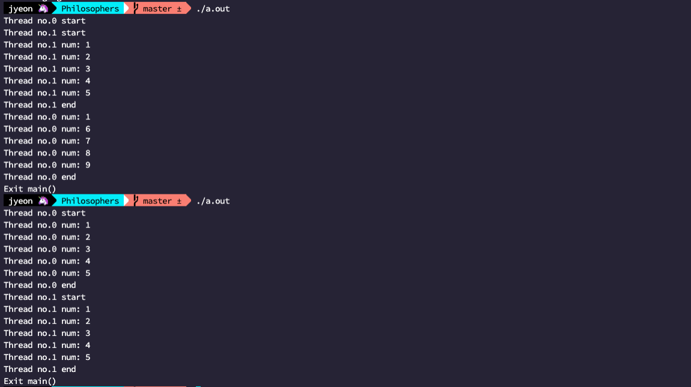
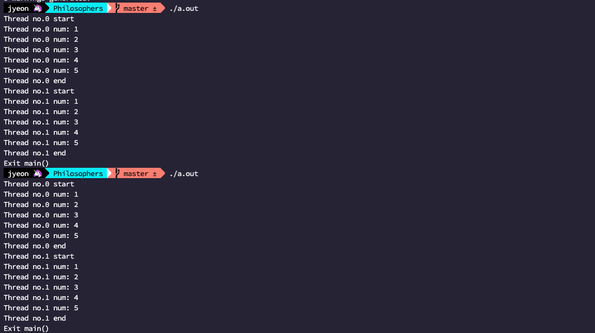

# 2022.05.21

## 해야 할 일

- [x] 서브젝트 이해하기
- [x] 허용 함수 공부하기
- [ ] Thread 공부하기
- [ ] 동기화 공부하기 (Mutex, Semaphore 간단히)
- [ ] 프로그램 설계하기
- [ ] 코드 작성하기
  - [ ] main

## Thread

```c
// pthread_join

#include <pthread.h>
#include <stdio.h>
#include <unistd.h>

void	*func(void *data)
{
	printf("%s\n", data);
	usleep(1000000);
	printf("Exit Thread no.0\n");
	return (0);
}

int	main(void)
{
	pthread_t		thread[3];
	int				ret;

	ret = pthread_create(&thread[0], NULL, func, "Hi! I'm Thread no.0");
	if (ret != 0)
		printf("Failed to create thread(0)\n");
	usleep(100000);
	pthread_join(thread[0], ret);
	printf("Exit main()\n");
	return (0);
}
```

인자들 타입 안맞아서 warning뜨는데 일단 무시하자


func가 실행되고 종료된 뒤에 main 함수의 마지막 printf가 실행된다.

pthread_join 라인을 주석처리해서 실행하면


func 함수의 실행시간이 1000000ms 이상이기 때문에 그냥 바로 main함수가 종료되어버린다.

---

일반적으로 스레드가 종료되면 자원이 계속 남아있게 된다. (메모리 누수!!!!!) join으로 종료를 하게 되면 종료를 기다린 스레드에 대한 메모리는 모두 회수가 된다고 하는데, 종료까지 기다리지 않고도 pthread_detach 함수로 생성 이후에 detach 시켜주면 굳이 기다리지 않아도 그 스레드는 종료 후에 알아서 메모리를 해제한다.

```c
// pthread_detach

int	main(void)
{
	pthread_t		thread[3];
	int				ret;

	ret = pthread_create(&thread[0], NULL, func, "Hi! I'm Thread no.0");
	if (ret != 0)
		printf("Failed to create thread(0)\n");
	pthread_detach(thread[0]);
	return (0);
}
```

이렇게 사용하면 된다.

## 동기화

참고 : <https://bitsoul.tistory.com/172?category=683199>

스레드는 코드 영역과 데이터 영역을 공유하기 때문에 (데이터 영역에는 전역변수, static 변수, ... 가 저장된다.) 이 공유 공간에 저장된 것들은 스레드들이 서로 수정하려고 하면서(Data Race) 원치 않은 결과가 발생할 수 있다.

```c
#include <pthread.h>
#include <stdio.h>
#include <unistd.h>

int num;

void *func(void *data)
{
	printf("%s start\n", data);
	num = 0;
	for(int i = 1; i <= 5; i++)
	{
		num++;
		printf("%s num: %d\n", data, num);
	}
	printf("%s end\n", data);
	return (0);
}

int main(void)
{
	pthread_t thread[2];
	int ret;

	pthread_create(&thread[0], NULL, func, "Thread no.0");
	pthread_create(&thread[1], NULL, func, "Thread no.1");
	usleep(1000000);
	printf("Exit main()\n");
	return (0);
}
```



이렇게 두번째 시도의 결과를 예상하고 짠 코드가 첫번째 시도처럼 예상치 못한 결과를 발생시킬 수 있다. 하나의 공유자원인 num에 두개의 프로세스가 접근하게 되면서 발생된 문제.

이럴 때 하나의 공유 자원에 한개의 스레드만 접근할 수 있게 하는 방법이 **Mutex**라고 한다.

### Mutex

mutual exclusion 상호배제

어떤 스레드에서 Critical Section을 실행하고 있는 경우에는 겹치지 않게, 다른 스레드들은 해당 Section에 접근할 수 없게 만드는 것이다. 앞선 스레드가 Critical Section을 벗어나야 다른 스레드가 접근할 수 있다. 이렇게 먼저 접근한 스레드가 lock을 풀어줘야 다른 스레드들이 접근할 수 있다는 것 같다.

### Mutex 함수들

```c
#include <pthread.h>

int pthread_mutex_init(pthread_mutex_t *mutex, const pthread_mutexattr_t *attr);
int pthread_mutex_destroy(pthread_mutex_t *mutex);
int pthread_mutex_lock(pthread_mutex_t *mutex);
int pthread_mutex_unlock(pthread_mutex_t *mutex);
```

`pthread_mutex_init()` 이 그 임계 영역을 초기화 하는 함수이고, `pthread_mutex_destroy()` 이 생성한 임계 영역을 해제 (free) 하는 함수이고, `pthread_mutex_lock()` 이 어떤 스레드에서 임계 영역에 접근해서 다른 스레드의 접근을 제한하는 함수, `pthread_mutex_unlock()` 이 먼저 접근했던 스레드에서 다른 스레드의 접근을 허용하기 위해서 unlock 하는 함수이다...! 오 이해됐다.

```c
// mutex lock test

#include <pthread.h>
#include <stdio.h>
#include <unistd.h>

int num;
pthread_mutex_t mutex;

void *func(void *data)
{
	printf("%s start\n", data);
  
	pthread_mutex_lock(&mutex);
  
	num = 0;
	for(int i = 1; i <= 5; i++)
	{
		num++;
		printf("%s num: %d\n", data, num);
	}
	printf("%s end\n", data);
  
	pthread_mutex_unlock(&mutex);
  
	return (0);
}

int main(void)
{
	pthread_t thread[2];
	int ret;

	pthread_mutex_init(&mutex, NULL);

	pthread_create(&thread[0], NULL, func, "Thread no.0");
	pthread_create(&thread[1], NULL, func, "Thread no.1");
	usleep(1000000);
	printf("Exit main()\n");
	return (0);
}
```



이런 식으로 num이 섞이지 않는다.

## 설계

### main

1. 인자 체크, 인자 처리해서 저장하기
2. 인자에 맞게 철학자 (스레드), 포크(?) 생성
3. ft_philo_start

문제는 허용 함수에 exit가 없어서 에러가 발생했을 때 메모리를 해제하고 종료하는 부분이 좀 까다로울 것 같다.... 일단 에러가 발생할 수 있는 모든 함수들에 반환값을 줘서 무조건 main까지 에러 상황이 도달할 수 있게 해 봐야겠다.

- [ ] **TRUE = 1, FALSE = 0**

### 인자 체크, 저장

`ft_philo_arg` 에서 이 작업을 하게 될 것이다.

```c
typedef struct s_args
{
	int	num_philo;
	int time_die;
	int time_eat;
	int time_sleep;
	int	num_eat;
	long long time_start;
	pthread_mutex_t *forks;
} t_args;
```

이런 식으로 저장하면 되지 않을까? `num_eat` 변수는 옵션이기 때문에 argc의 값에 따라서 값을 달리 해 줘야 할 듯 하다.

- [ ] **atoi 필요함.**
- [ ] **각 인자들이 숫자가 아닐 경우 확인하기.**
- [ ] **스레드 함수에 인자 하나만 전달할 수 있기 때문에 이후에 만들어질 구조체들까지 모두 묶을 구조체 하나 필요할듯?**

### 철학자 초기화하기

`ft_philo_init` 에서 이 작업을 하게 될 것이다.

철학자"들"에 대한 정보를 저장할 구조체 배열이 필요할 것 같다. 필요한 정보는 해당하는 스레드 ID, 왼쪽포크 오른쪽포크 보유 여부, 마지막 밥먹은 시간, 밥먹은 횟수, status(?)

```c
typedef struct s_philo
{
	pthread_t thread;
	int	l_fork;
	int r_fork;
	int last_eat_time;
	int cnt_eat;
	int status;	
}
```

이건 실제로 코드 짜 보면서 어떤 형태의 정보가 필요한지 봐야 할 것 같다.

포크도 뮤텍스 배열로 만들어야 할 듯! 이거는 args에 넣는 것이 좋을 것 같으니 그쪽에다가 넣어주자 (추가 완료)

### ft_philo_start

어떻게 하지.

## 코드 작성하기

### ft_philo_arg

num_philo와 num_eat은 0이하가 되면 안되고, 그 외의 변수들은 음수가 되면 안된다. 어쨌든 둘 다 음수가 되면 안되는 상황이라 philosopher를 위한 atoi 함수인 ft_philo_atoi에서 음수이면 그냥 -1을 반환해서 오류처리하게 만들었다.

사실 클러스터환경에서의 atoi에서는 이상한 입력이 들어오면 0을 반환하는 것 같은데 이 경우를 적용하면 상식적으로 이상한 인자 전달을 하더라도 작동이 잘 되는 문제가 발생할 수 있어서 그냥 엄청 보수적인 atoi로 ft_philo_atoi 함수를 만들었다.

그리고 옵션 인자인 `num_eat` 은 만약에 입력이 들어오면 그냥 입력을 받아 주었고 (당연히 인자 체크는 해 줬음) 입력이 없을 경우에는 0을 넣어 주었다. 오류처리 부분에서 살짝 헷갈릴 수 있는데 만약에 입력이 들어온 경우라면 `num_eat` 값에 0이 들어 있으면 안되지만 입력이 없는 경우라면 기본적으로 `num_eat`에는 0이 들어있다.

~~맞다 또 까먹을 뻔... 포크도 초기화해주자.~~

~~또 까먹을 뻔... 시작 시간도 초기화해주자. (시작시간부터 얼마동안 안먹으면 죽음... 그거 확인용도)~~ (위의 구조체 구조에 추가 완료)

포크 초기화랑 시작시간 초기화는 뒤의 philo_init에서 해 주기로 했다. (에러 메시지를 비교적 통일성있게 출력해주기 위해서...ㅜ)

### ft_print_error 와 main 흐름

허용함수에 printf 함수 없는 줄 알고 식겁했다. 메모리 해제 하는 부분은 일단 제껴두고 받아온 메시지를 그대로 출력할 수 있게 만들어주었다.

main에서 매번 함수의 반환값을 확인하고, 만약에 반환된 값이 FALSE일 경우에는 에러를 출력하는 함수를 호출하고, main으로 다시 돌아와서 return (0) 를 해 주는 것이 되게 귀찮다. (매 조건문마다 return 을 해 줘야 다음 코드로 이동하지 않겠지?) 일단 전체적인 흐름을 if 조건문을 여러개 써서 만들고 있기 때문에 if - else if 문을 사용하는 것이 좋겠다고 생각했다. 지금까지 조건문을 아무 생각없이 썼었어가지고 긴가민가했었는데 다시 정리하면..

```c
int	main(int argc, char **argv)
{
	int num = 6;
	//int num = 8;

	if (num % 3 == 0)
		printf("haha\n");
	else if (num % 2 == 0)
		printf("hoho\n");
	else 
		printf("hihi\n");

	return (0);
}
```

이 때 num 이 6인 경우에는 출력은 `haha` 만 되고, 8인 경우에는 `hoho` 만 출력된다. 맞는 조건문이 나올 때까지 쭉 내려가다가 조건에 맞는 것이 나오면 아래는 보지 않고 바로 조건문을 빠져나간다.

이걸 왜 지금 정리하고 있지... 아무튼 main문에서는 if - else if 문으로 실행 함수의 조건을 확인해주고, 종료해주었다.

### ft_philo_init

`ft_fork_init()`, `ft_gettime()`

철학자에 해당하는 스레드들을 생성해줘야 한다. 생성도 하고 그 철학자 정보들도 초기화 해 줘야 한다.

고민되는게 지금 여기서 철학자에 해당하는 스레드를 생성하는게 맞는지? 아니면 실제로 뭔가 동작을 시작할 ft_philo_start에서 생성하는게 맞는건지 모르겠다... 어차피 생성하는데는 코드 두줄이면 되기 때문에 일단은 각 philo 구조체에 값 할당하는 것만 해 둬야겠다.

## 설계

~~분명히 어제 push를 했다고 생각했는데.. 안했네...? 그리고 하필이면 goinfre에 클론을 해둬서... 사라졌다 내 고민의 흔적... 그래서 어제까지 생각했던 부분 간단하게 정리하기~~

일단 우선이 되어야 하는 부분은 데드락을 피해야 하는 것이다.


이 경우에 1번 철학자가 1번 숟가락을 들고, 2번 철학자가 2번 숟가락을 들게 되면 계속 다음으로 진행이 불가능하여 데드락이 발생하는 것이다.

참고 : <https://velog.io/@yanghl98/%EC%9A%B4%EC%98%81%EC%B2%B4%EC%A0%9COS-Deadlock%EB%8D%B0%EB%93%9C%EB%9D%BD-%EC%A0%95%EC%9D%98-%EB%B0%9C%EC%83%9D-%EC%A1%B0%EA%B1%B4-%ED%95%B4%EA%B2%B0-%EB%B0%A9%EB%B2%95>

데드락에 대한 해결책은 (1) 예방 (2) 회피 (3) 탐지와 회복이 있는데

(1) 예방은 일단 발생하지 않게 미리 조치를 취하는 방식이다. 교착상태 발생 조건 4가지 중 하나를 제거하는 방식인데 방법을 보니까 우리 프로젝트하고는 좀 맞지 않아 보인다. (사실 어떻게 구현하는지도 모르겠음)

(2) 회피는 일단 데드락의 발생 가능성을 인정하고, 최대한 데드락이 발생하지 않도록 회피하는 방식이다. 데드락을 발생시킬 수 있는 자원을 안전지대 (Critical Section)에 넣어두고 접근 요청이 올 때 마다 체크를 하는 방식이다. 아무래도.. 우리가 하려는 방법이 포크에 대한 접근을 제한하는 방식이니만큼 우리가 이 프로젝트에서 데드락을 피하는 방법은 회피 방식인 것 같다.

(3) 마지막으로 탐지와 회복은 데드락이 발생한 것을 확인한 후에, 자원 할당을 해제하거나 해서 그 데드락 상태를 빠져나오는 방식이다. 내가 아는 선에서는 데드락이 발생한 것을 알아차린다 하더라도 철학자가 잡은 포크를 다시 내려놓는 방법을 잘 모르겠어서.. 이 방식도 패스다.

우리 상황으로 돌아와서 어떻게 가능하면 철학자들의 식사가 멈추지 않고 최대한 기다리는 시간 없이 얼른 먹을 수 있을지에 대해서 생각해봤는데 처음에는 이런 생각을 했었다.


1. 1번 철학자는 1번과 3번 숟가락을 들고 밥을 먹는다.
2. 3번 철학자는 2번 숟가락을 들고 생각한다.
3. 2번 철학자는 생각한다.
4. 1번 철학자가 밥을 다 먹고 숟가락을 내려두고 잠을 잔다.
5. 3번 철학자는 3번 숟가락을 들고 밥을 먹는다.
6. 2번 철학자는 1번 숟가락을 들고 생각한다.
7. 3번 철학자가 밥을  다 먹고 숟가락을 내려두고 잠을 잔다.
8. 2번 철학자가 2번 숟가락을 들고 밥을 먹는다.

이런 흐름으로 생각을 하고 있었는데 집에 와서 곰곰이 생각해보니 의문이 들어서 이 방식을 그대로 사용할 수 있을지는 모르겠다.

- 숟가락을 들고 생각상태에 들어있으면 안될 것 같다. 당연한건가? 우연찮게(순서를 보장할 수 없으므로) 다들 하나씩 잡게 되면 바로 데드락에 빠지는 것이기도 하고, 기아상태를 최소화하기 위해서라도 일단 먹을 수 있는 상태의 철학자가(양쪽의 숟가락이 모두 사용가능한 상태인) 먼저 먹기 시작하는게 맞을 것 같기도 하다... 실제로 코드를 돌려봐야 더 정확하겠지만
- 아까 적긴 했는데 스레드의 실행이 큐처럼 FIFO 순서가 보장되는 것이 아니라 진짜 랜덤이라고 했다. 그러면 위의 시나리오는 일단 홀수 번째 철학자가 먼저 행동을 할 수 있게 만들어둔 것인데 뭔가 꼬여서 2번이 먼저 다른 행동을 하게 된다면 예상치 못한 결과가 나올 수 있을 것 같기도 하다. 어떻게 짝수와 홀수 번째 철학자의 행동에 순서를 부여할지도 좀 고민을 해 봐야 할 듯...?

여기까지가 어제(21일) 기록.

## 해야 할 일 (Update)

- [x] 서브젝트 이해하기
- [x] 허용 함수 공부하기
- [x] Thread 공부하기
- [x] 동기화 공부하기 (Mutex 간단히)
- [ ] 프로그램 설계하기
  - [x] main
  - [x] 인자 체크, 저장하기
  - [x] 철학자 초기화하기
  - [ ] ft_philo_start
- [ ] 코드 작성하기
  - [x] main
  - [x] 인자 체크, 저장하기
  - [x] 철학자 초기화하기
  - [ ] ft_philo_start
- [ ] 테스트
  - [ ] 테스터 돌려보기
  - [ ] 서브젝트 다시 확인하기
  - [ ] 평가표 ?
- [ ] 평가 준비
  - [ ] 개념 다시 정리
  - [ ] 코드 리뷰