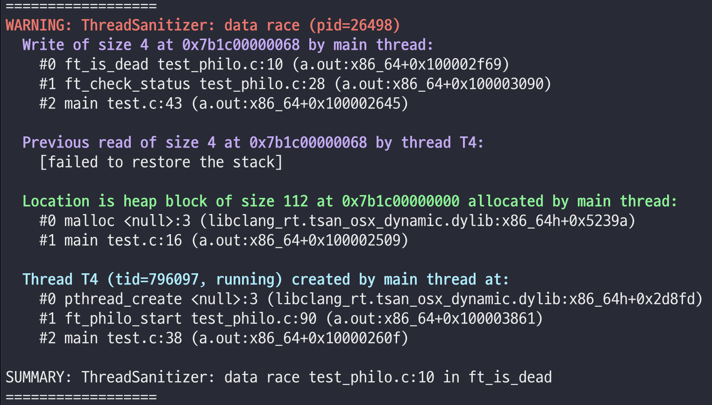

# 2022.05.26

일일 기록을 지금까지 작성하지 못했던 이유는 뭔가 삽질을 하다가 해결한 결론이 나야 기록을 할 가치가 있을텐데 지금까지 의문만 쭉 생기고 해결하지를 못해서... 기록을 못했다.

다행히도 뭔가 실마리를 찾게 되어서 다시 정리를 할 수 있게 되었다.

## 문제 해결 기록

### ft_philo_act에 단 하나의 매개변수만 전달할 수 있다

각 스레드마다 실행될 함수가 ft_philo_act 함수이다. 이 함수에서는 **각각의 철학자**가 종료 조건이 맞지 않는 동안 계속해서 먹기를 시도하다가 먹고, 자고, 생각하고를 반복해야 한다.

완전 처음에 생각하고 있던 자료구조는 아래와 같은 형태였는데

```c
typedef struct s_philo
{
    pthread_t thread;
    // 각각의 철학자들의 개인 정보들 (마지막으로 밥 먹은 시간, 인덱스, ... 등)
} t_philo;

typedef struct s_args
{
    int num_philo;
    // 실행인자를 포함한 프로그램에서 사용해야 하는 인자들
} t_args;

typedef struct s_data
{
    t_philo *philos; // philo 배열
    t_args args;
} t_data;
```

이런 식으로 자료구조를 설정한 뒤에 ft_philo_act를 실행할 때 t_data 타입의 매개변수를 전달하게 되면 현재 스레드가 어떤 철학자에 대한 스레드인지를 특정할 수 없다는 아주 심각한 문제가 있었다.

아무리 생각해도 별 아이디어가 떠오르지 않아서 좀 고생을 했는데 다른 분들을 보니 t_args 변수를 하나 두고, s_philo 구조체 내에 t_args 변수를 가리키는 포인터를 넣은 뒤에 새로운 스레드에는 t_philo 하나를 전달해서 모든 철학자들이 동일한 t_args에 접근할 수 있고, 스레드에서는 딱 하나의 philo만 다룰 수 있게 구현하셨더라.

다른 좋은 방법이 생각나지 않아서 나도 이렇게 자료구조를 짰다. 그래서 지금의 자료구조는 아래와 같다.

```c

struct s_args
{
    int num_philo;
    int time_die;
    int time_eat;
    int time_sleep;
    int num_eat;
    int finish_eat_cnt;
    long long time_start;
    pthread_mutex_t *forks;
    pthread_mutex_t print_philo;
    int end_flag;
};

struct s_philo
{
    t_args *args;
    int idx;
    pthread_t thread;
    int left_fork;
    int right_fork;
    int cnt_eat;
    long long time_last_eat;
};

```

### 종료 조건 확인 방법

최대 200명(평가표에 따르면 그렇다더라)의 철학자들이 행동하는 동안 상태를 모두 확인하고, 종료 조건이 되자마자 빠르게 확인해서 출력할 수 있는 방법에서 또 막혔었는데ㅋㅋ 생각해보니 엄청 간단한 문제였다.

철학자들이 먹고 자고 생각하는 동안 **메인 스레드**는 놀고 있으므로 여기서 철학자들이 죽을 상황인지, 밥을 조건만큼 다 먹었는지 이런 것들을 확인해 주면 되는 것이었다. 멀티 스레드를 사용만 하고 있었지 활용할 생각을 못하고 있었다... 허허

아무튼 그래서 t_args 에 end_flag라는 변수를 넣어 준 다음에, 상태를 확인하면서 어떤 철학자가 죽거나, 밥을 다 먹은 상태면 기본값인 FALSE에서 TRUE로 값을 변경해 주고, 철학자 스레드들에서는 어떤 행동을 하기 전에 무조건 end_flag 값을 확인하는 방식으로 최대한 end_flag가 TRUE인 경우에 추가로 행동을 하지 않도록 해 주었다.

```c
// philo.h
struct s_args
{
    // 생략
    int end_flag; // 기본값 : FALSE
};

// philo.c
void ft_check_status(t_args *args, t_philo *philos)
{
    int idx;
    int cnt;

    while(1)
    {
        idx = 1;
        cnt = 0;
        while (idx <= args->num_philo)
        {
            if (ft_is_dead(args, philos[idx]) == TRUE)
                return;
            if (args->finish_eat_cnt == args->num_philo)
            {
                args->end_flag = TRUE;
                return;
            }
        }
    }
}
```

이런 식으로 해서 대충 해결했거니... 하고 생각하고 있었는데 죽음을 확인하는 `is_dead` 함수에서 data race가 발생하는 것을 이거 쓰면서 확인했다. 정말 죽지도 않고 생겨나는 에러들...  (피곤하다)

### pthread 계열 함수에서 발생했던 abort 문제

main 함수에서 변수를 전달하던 방식은 t_args 타입의 변수 하나, t_philo 타입의 포인터변수 하나를 선언해서 주소를 전달하는 방식으로 이런저런 함수들에서 활용을 하고 있었는데...

스레드를 생성해서 전달된 값을 확인해보려고 `ft_philo_act()` 함수에서 값을 출력해봤는데 abort가 뜨거나, 쓰레기값이 출력되었다.

아무리 생각해도 이유를 모르겠어서 정말 오래 머리를 싸매고 있었는데 (다른 분들을 봐도 비슷하게 구현하셨던데 왜 나만... 나만 에러가 나는 거냐고) 어제 간신히 해결을 했다.

앞서 스레드에 대해서 공부할 때 한 프로세스에서 생성된 스레드들은 **데이터 영역** 과 **힙 영역**을 공유한다고 했었다. 그러니까 **스택 영역**은 공유하지 않는 것이다. 스택 영역에는 지역변수나... 이런 것들이 저장되고 데이터 영역에는 정적변수와 전역변수 등등이 저장, 힙 영역에는 동적할당된 공간들이 저장된다.

그러니까 main함수에서 지역변수로 선언한 t_args 변수의 주소를 `ft_philo_act()` 에 전달을 하더라도, 이 스레드에 대한 스택 영역은 따로 생성되어 있기 때문에 abort나 쓰레기값이 출력되는 것이었다.

그래서 main에서 둘 다 동적할당을 해서 힙 영역에 각각의 데이터들이 저장될 수 있게 만들어주었다.

```c
// main.c
int main(int argc, char **argv)
{
    t_args *args;
    t_philo *philos;

    args = (t_args *)malloc(sizeof(t_args));
    // 생략
    philos = (t_philo *)malloc(sizeof(t_philo) * args->num_philo);
    // 생략
    return (0);
}
```

근데 다른 분들의 코드를 봤을 때에는 딱히 지역변수를 사용하셨어도 문제가 없었던 것 같아서 이게 정확한 문제의 원인이었는지는 잘 모르겠다. 사실 주소전달하고 이리저리 변환하면서 헷갈려 죽는 줄 알았기 때문에 여기서 문제가 있었을수도 있다. 근데 어쨌든 발생하던 오류가 이렇게 고침으로 인해서 사라졌고, 내가 알고 있는 지식으로는 이렇게 하는 것이 더 맞는 것 같기 때문에 그냥 이렇게 생각하고 있기로 했다 하하.

### 출력 메시지에 색 입히기

.png)

~~출력 내용은 무시...~~

출력되는 메시지가 엄청 많은데 구분하기가 쉽지 않다.

출력은 잘 되는데 이게 맞는건지,, 아닌건지 잘 모르겠어서 상태별로 색깔을 입혀서 출력될 때 구분이 잘 되게 만들어주었다.

```c
// philo.h
# define HAS_FORK "has taken a \033[0;32mfork\033[0m"
# define IS_EATING "is \033[0;36meating\033[0m"
# define IS_SLEEPING "is \033[0;34msleeping\033[0m"
# define IS_THINKING "is \033[0;33mthinking\033[0m"
# define DIED "\033[0;31mdied\033[0m"
```

이런 식으로 색을 설정해서 출력을 해 주면

.png)

구분이 잘 되고 뭔가 이상한 부분도 잘 보인다... 하하

## 고민중인 내용 (해결되면 방법 정리해서 위쪽에 적을 예정)

### data race 해결

그냥 서브젝트에서 mutex 사용하라고 data race 없게 해야 한다는 언급을 한 줄 알았었는데 원래는 서브젝트에서도, 평가표에서도 이 data race라는 말이 없었던 것 같다.

아무튼 이제 평가시에도 data race 여부를 확인한다는 것 같기 때문에 나도 확인을 해 줘야 하는데... 아까 적었듯이 혹시나 해서 플래그 넣어서 돌려보니까 data_race가 발생한다고 하네... 당연히 없을 줄 알았는데 뭔가 떠서 굉장히 당황스럽고 나중에 찬찬히 오류메시지 읽어보면서 확인해봐야 할 것 같다. 이 과제 대체 언제 끝나니?



### 출력 순서에 대한 고민

이리저리 과제에 대해 서치를 하다가 언뜻 출력 **순서**가 꼬이면 안된다는 말을 봤던 것 같아서 다시 서브젝트를 확인해봤는데 출력 순서에 대한 언급은 없고 출력 메시지가 꼬이면 안된다는 말은 있다. 메시지 내용이 훼손되면 안된다는 뜻으로 해석했다.

> A displayed state message should not be mixed up with another message.

근데 이제 고민되는 부분이 숟가락 놓고 잠들어야 다른 녀석이 놓은 숟가락을 잡는게 맞는 것 같은데... 가끔은 숟가락 잡는게 먼저 출력되고 잠들었다는 메시지가 출력된다.

문제가 되는 상황이 맞는지, 그래서 해결을 해야 하는 부분인지, 해결은 어떻게 해야 하는지를 좀 생각해봐야 할 것 같다.

### 힙 버퍼 오버플로우

그놈의 ft_philo_init... 에러란 에러는 모두 여기서 발생한다. fsanitize=address 옵션을 넣어보니 시작하자마자 문제가 발생해서 다시 확인해봐야 할 것 같다.

### 무한바람개비

스레드 생성 때문에 얘가 힘들어하는건지 모르겠는데 자꾸 다른 프로그램에서 무한 바람개비현상이 생긴다. 용량은 아주 넉넉함. 과제 해결에는 문제가 없지만 내 정신 상태에 아주 큰 영향을 미치는 문제이다.

---

놀랍게도 내일 평가 목표임. 나 할 수 있을까...?
