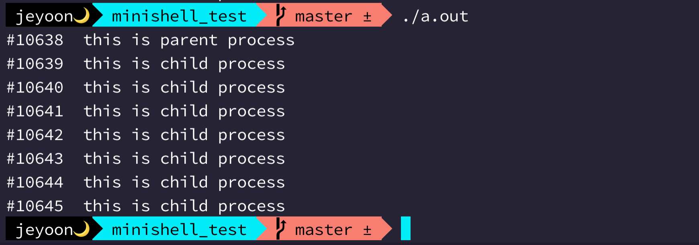

# 2022.06.04

## 현재 상황

- minishell 프로젝트를 시작한지 3일째.
- 허용함수 공부를 대강 완료함. 필요한 내용은 팀원과 공유하는 노션에 함께 정리함.
- 나는 명령어 파싱 부분을 담당하기로 했다.
- 서로 상대가 담당할 부분에 대해서 공부하기로 하고, 내일 전반적인 flow를 고민해보기로 했다.

## 프로세스 생성 연습

자식 프로세스 생성은 `fork()` 라는 함수로 한다.

```c
#include <unistd.h>

pid_t fork(void);
```

```c
#include <stdio.h>
#include <unistd.h>

void func_parent()
{
	printf("this is parent process.\n");
}

void func_child()
{
	printf("this is child process\n");
}

int main(void)
{
	pid_t pid;

	pid = fork();
	printf("hello!!\n");
	if (pid)
		func_parent();
	else
		func_child();
	return (0);
}

```

18번 라인에서 `fork()`가 호출되면, 자식프로세스는 18번 라인의 반환부터 실행이 되는 것 같다. (코드가 복사되는 느낌?)


이런 식으로 조건문 밖의 내용들은 부모, 자식 프로세스 둘 다에서 실행이 되고, pid를 조건으로 걸어주면 부모/자식의 작업을 따로 설정할 수 있다.

---

부모 프로세스에서 `fork()`를 호출하면 생성이 성공했을 때 자식 프로세스의 PID가 반환이 되고, 자식 프로세스는 0을 반환받게 된다. 그래서 자식프로세스에서는 pid에 0을 받았을테니 `func_child()` 함수가 실행되는 것이고 부모 프로세스에서는 생성한 자식프로세스의 PID인 0이 아닌 값을 pid에 받았으므로 `func_parent()` 함수가 실행되는 것이다... 오호

그럼 만약에 포크를 여러 번 한다면? 자식 프로세스를... 여러번 만들어봤는데

```c
#include <stdio.h>
#include <unistd.h>

void func_parent()
{
	printf("this is parent process.\n");
}

void func_child(int pid)
{
	printf("#%d\tthis is child process\n", pid);
}

int main(void)
{
	pid_t pid;

	printf("#%d\tthis is parent process\n", getpid());
	pid = fork();
	if (pid == 0)
		func_child(getpid());
	pid = fork();
	if (pid == 0)
		func_child(getpid());
	pid = fork();
	if (pid == 0)
		func_child(getpid());
	return (0);
}
```



너무 당연하게도 가장 첫번째 생성했던 자식 프로세스에서 fork 2회, 두번째 생성한 자식 프로세스에서 fork 1회 해서 원하는 만큼 안나온다. (운영체제 수업 시간에 들었던 것 같기도 하다.)

자식 프로세스는 할일 다 하면 `exit()` 함수로 종료되게 만드는 것이 맞는 것 같다.

```c
#include <stdio.h>
#include <unistd.h>
#include <sys/wait.h>
#include <stdlib.h>

void func_child(int pid)
{
	printf("#%d\tthis is child process\n", pid);
	exit(0);
}

int main(void)
{
	pid_t pid;
	int status;

	printf("#%d\tthis is parent process\n", getpid());
	pid = fork();
	if (pid == 0)
		func_child(getpid());
	pid = fork();
	if (pid == 0)
		func_child(getpid());
	pid = fork();
	if (pid == 0)
		func_child(getpid());
	return (0);
}
```


