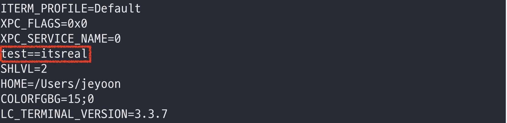

# 2022.06.06

## 1. 연결리스트 만들기

연결리스트 생성은 push_swap에서 양방향 원형 큐 구현하면서 완전 마스터한줄 알았는데 이번에도 조금 고생을 했다.

단순히 공백만을 기준으로 자르는 것이 아니라 따옴표가 등장하면 따옴표가 끝나는 부분까지를 하나의 토큰으로 생각해주었고 따옴표를 "포함"해서 일단 연결리스트 노드에 넣어주었다. 나중에 따옴표 관련된 작업을 하면서 따옴표를 잘라내든지 뭐 이런 작업을 해야 할 듯 하다...🤦‍♀️

함수 분리하는 것이 너무 어렵다. 만약에 연결리스트에서 트리 구조로 바꾸게 된다면 무슨 무시무시한 일이 생길지 상상하기도 싫어졌다. 왠만하면 그냥 연결리스트로 구현이 잘 되었으면 좋겠다. 😇

## 2. execve 함수

파싱을 하게 되면 토큰의 위치에 따라 의미부여를 해 줘야 하는데 빌트인 함수 외의 경우에는 이게 valid한 옵션이라 옵션으로 취급해줘야 하는지? 아니면 단순 argument로 취급해줘야 하는지? 이런 문제를 내 쪽에서 해결을 해야 하는건가? 하는 생각이 들었었다.

근데 팀원에게 물어보니 execve에서 인자를 받을 때에 구분 없이 들어오는 입력되는 순서대로 문자열 배열을 만들어서 전달받는 방식이래서 그냥 CMD에 해당하는 부분이 빌트인 함수가 아닌 경우에는 순서만 잘 맞춰서 ARG 타입으로 넘겨주면 되겠다는 생각을 했다.

~~걱정했는데 생각보다 간단해서 다행이다.~~

## 3. 멀티라인 커맨드에 대해서

어제 단순 입력 부분을 구현하면서 따옴표가 안 닫히는 부분에 대해서는 그냥 에러 처리를 해 줬었는데 오늘 다시 얘기를 해 보았다.

실제 배쉬에서는 따옴표가 안닫히면 따옴표가 닫힐 때까지 계속 입력을 받는데 우리의 초미니나노쉘에서는 멀티라인은 구현하지 않기로 했다.

같은 예로 cat 명령어 뒤에 인자가 안오는 경우도 마찬가지일듯.

## 4. 미니쉘 구현 범위에 대해서

찾아보면 찾아볼수록 예외사항이 엄청 많다.

오늘 알게된 충격적인 예외는 환경변수의 이름에는 본래 `=` 문자를 넣을 수 없지만 `+=` 를 넣어주면 `=` 이 추가된 상태로 환경변수 설정이 된다는 것이었다.

우리 팀은 `=` 을 기준으로 변수이름과 값을 구분하려고 하던 참이라 굉장히 당황스러웠는데 결론만 말하면 구현하지 않기로 했다. 뭐 구현하면 좋기야 하겠지만 모든 기능을 다 구현하게 해 버리면 미니쉘이 아니라 걍 쉘이 되어버리기 때문에.. 무조건 서브젝트를 기준으로 추가하면 좋고? 아님 말고 라는 느낌으로 구현 범위를 확실하게 잡는 것이 엄청 중요한 것 같다.

초미니나노쉘을 지향합니다... 만들어야 하는 것을 잘 만들자.

## 5. 내일부터는

연결리스트로 어쨌든 잘라서 다 만들어줬으니 이제 이 녀셕이 어떤 역할인지, 커맨드인지, 옵션인지, 인자인지 파이프인지, 리다이렉션인지를 판단해서 넣어줘야한다.

순서가 중요한 문제인지를 좀 확인해봐야 할 것 같아서 빌트인, 리다이렉션, 파이프 부분의 순서를 이것저것 섞어보면서 확인해봐야 할 것 같다.
