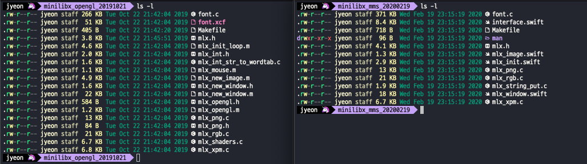
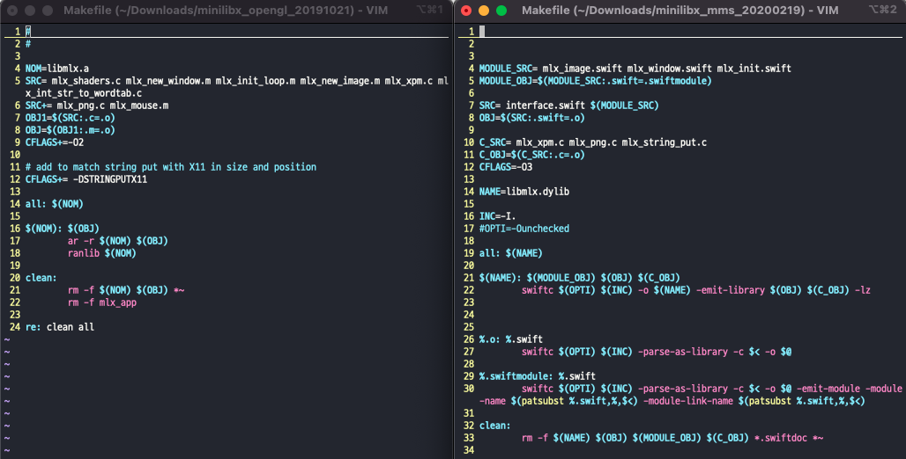

# 2022.05.11 log

## minilibx

서브젝트에서 주어지는 라이브러리 파일이 2종류가 있는데 (opengl, mms) 일단 이 둘이 뭔지, 무슨 차이가 있는지부터 먼저 알고 결정해야 할 것 같아서 공부해보았다.

### minilibx

**참고**

- <https://harm-smits.github.io/42docs/libs/minilibx.html>

많은 지식 없이도 간단하게 창을 띄울 수 있는 그래픽 라이브러리. 창을 띄우고 원하는 이미지를 원하는 위치에 출력하거나, 키 이벤트를 걸거나 하는 일들을 할 수 있다. 딱 우리 과제에서 필요한.. 그런 기능들을 이 라이브러리로 구현 할 수 있다는 것.

### opengl, mms

주어지는 파일이 **minilibx_opengl.tgz**, **minilibx_mms_20200219_beta.tgz** 이렇게 2개 있는데 둘 중 하나만 사용하면 된다.

일단 모르겠으니... 둘 다 다운받고 열어봤다.



makefile이 있어서 냅다 make를 시도했는데 둘다 안된다 🥲 아마도 내 맥북이 m1이라서 그런 것 같은데 이건 나중에 해결하고 (사실 그냥 클러스터 가면 해결 됨) makefile 내부만 확인해봤다.



오... opengl로는 `libmlx.a`를 만들 수 있고 mms로는 `libmlx.dylib`를 만들 수 있다.

정적/동적 라이브러리 차이였구나.

그냥 간단하게 정리하면

- 정적 라이브러리 (확장자 .a)
  - 라이브러리의 코드들을 컴파일 과정 중에 실행파일에 추가한다.
  - 실행파일 안에 라이브러리의 코드들이 복사되어 있기 때문에 실행파일의 크기가 크다.
  - 실행파일을 실행할 때 라이브러리 파일이 필요하지 않다.
- 동적 라이브러리 (확장자 .dylib)
  - 실행파일을 실행할 때 필요한 기능들을 불러서 사용한다.
  - 실행파일에는 라이브러리의 코드 전체가 아닌 호출할 수 있는 함수의 정보만 포함되기 때문에 실행파일의 크기가 작다.
  - 실행파일을 실행할 때 라이브러리 파일이 필요하다.

**참고**

- <https://jeonjeunghoon.tistory.com/entry/x86-%EB%A7%88%EC%9D%B4%ED%81%AC%ED%94%84%EB%A1%9C%EC%84%B8%EC%84%9C-dylib-%EB%8F%99%EC%A0%81%EB%9D%BC%EC%9D%B4%EB%B8%8C%EB%9F%AC%EB%A6%AC%EC%99%80-%EC%A0%95%EC%A0%81%EB%9D%BC%EC%9D%B4%EB%B8%8C%EB%9F%AC%EB%A6%AC>
- <https://goodgid.github.io/Static-VS-Dynamic-Libray/>

저는 그냥 opengl 버전을 사용하기로 했답니다. (돌려보는것은 클러스터 가서 돌려보기로...)

## 과제 완료를 위해 해야 할 일

- [ ] Map 읽어들이기
- [ ] 에러 처리하기
- [ ] 이미지 창에 띄워보기
- [ ] key hook
- [ ] 동작 구현하기
- [ ] 테스트
- [ ] (가능하다면) Bonus 중 움직임 화면에 출력하는 기능 추가
- [ ] 평가 준비하기

## map 읽어들이기

map은 `get_next_line` 함수로 읽어들이면 되겠다.

어차피 map은 직사각형 모양일 것이기 때문에 굳이 2차원 배열로 저장하지 않고 배열 하나를 이용해서 인덱스를 조정해가면서 2차원 map을 관리해도 괜찮지 않을까...? 하고 생각했는데 이렇게 생각하다간 나부터 헷갈릴 것 같아서ㅋㅋ 그냥 2차원 배열로 저장하기로 했다. 

### map을 위한 메모리 할당

메모리 할당을 해 줘야 하기 때문에 map 파일을 두번 읽는 것이 불가피할 것 같다.

```c
//so_long.h

struct s_map
{
	char	**map;
	int		width;
	int		height;
};

struct s_data
{
	t_map	*map_info;
};

```

한번 읽고 맵의 최대 넓이와 높이를 구해 준 다음에 2차원 배열 메모리 할당해주기

```c
//map_read.c

static int	malloc_map(t_data *game_data, char *file_name)
{
	int	i;

	get_map_size(game_data, file_name);
	game_data->map_info->map = (char *)
		malloc(sizeof(char *) * game_data->map_info->height);
	if (game_data->map_info->map == NULL)
		return (FALSE);
	i = 0;
	while (i < game_data->map_info->height)
	{
		game_data->map_info->map[i] = (char *)
			malloc(sizeof(char *) * game_data->map_info->height);
		if (game_data->map_info->map[i] == NULL)
			return (FALSE);
		i++;
	}
}
```

11일 노트는 여기까지

