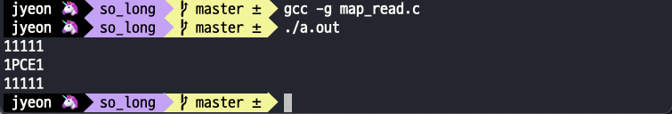

# 2022.05.12

## 과제 완료를 위해 해야 할 일

- [ ] Map 읽어들이기
- [ ] 에러 처리하기
- [ ] 이미지 창에 띄워보기
- [ ] key hook
- [ ] 동작 구현하기
- [ ] 테스트
- [ ] (가능하다면) Bonus 중 움직임 화면에 출력하는 기능 추가
- [ ] 평가 준비하기

## map 읽어들이기

일단 맵을 읽어들이는 main function은 `read_map`이다.

```c
// map_read.c

void	read_map(t_data *game_data, char *file_name)
{
	if (malloc_map(game_data, file_name) == FALSE)
		error_exit("Error: Memory allocation failed.\n");
	load_map(game_data, file_name);
}
```

이제 해야 할 것은 `load_map`

### map 불러와서 저장하기

원래는 `get_next_line`을 이용해서 map에 저장해주는 방법을 사용하려고 했었는데. 생각해보니까... 그냥 read 함수 반복해서 char 단위로 넣어주는 방법이 더 간단하지 않나..? 해서 해 보기로 했다.

```c
// map_read.c

static void	load_map(t_data *game_data, char *file_name)
{
	// (생략)
	while (read(fd, &c, 1) > 0)
	{
		if (c == '\n')
		{
			game_data->map_info->map[i][j] = '\0';
			i++;
			j = 0;
		}
		else
		{
			game_data->map_info->map[i][j] = c;
			j++;
		}
	}
}
```



함수 모양이 썩 아름답진 않지만 malloc - free 반복하는 것 보다는 이 쪽이 나을 것 같다. 어차피 get_next_line 함수 내부도 이거랑 비슷하게 생겼고 ㅇㅇ

테스트 하면서 알게 된건데 map size 재는 함수에서 height 부분이... 나중에 테스트하면서 문제의 소지가 있을 것 같다는 생각이 들었다. 지금 상태로는 엄청 수상한 상태인데ㅋㅋㅋ

```c
// read_map.c

static void	get_map_size(t_data *game_data, char *file_name)
{
	int		fd;
	char	c;
	int		temp;

	fd = ft_open(file_name);
	game_data->map_info->height = 1;
	game_data->map_info->width = 0;
	// (생략)
}
```

반복문 종결 조건 때문에 마지막 줄을 세지 못하는 문제가 있었다. 일단ㅋㅋㅋ 일단은 그냥 초깃값을 1로 해주는 방법으로 해결하긴 했는데 이제... map의 height가 한줄에 개행이 하나 있을 경우라던가.. 뭐 이런 경우에 문제가 생길 것 같긴 하다. 일단 대충 돌아가게 만들어 두고 테스트 과정에서 섬세하게 다시 고쳐봐야 할 듯 하다. 

아무튼 찜찜하지만 map 읽어들이기 완료

## Map error 처리하기

예외처리가 아니고 에러처리다! 서브젝트에 정리되어있는 유효한 맵의 기준을 정리하면 아래와 같다.

- 맵을 구성하는 문자는 오직 5개 → 0, 1, C, E, P

  그렇다는 것은 그 외의 문자가 온다면 에러로 처리해줘야 한다는 것.

- 반드시 wall(1)로 둘러싸여 있어야 하고, 닫혀 있어야 한다. 

  가장 윗줄과 가장 아랫줄은 모두 1로 되어 있어야 하고, 그 외의 줄들도 가장 첫번째 문자와 가장 마지막 문자는 1이 되어야 한다.

- 적어도 1개의 exit(E), 한개의 collectible(C), 한개의 starting position(P)이 있어야 한다.

- 길이 있는지는 체크할 필요가 없다.

- 반드시 직사각형 모양이어야 한다. (모든 row의 길이가 같아야 함.)

간단히 처리해주면 될 것 같다. 어렵지 않음.

아 맞다. 에러 처리 함수 `error_exit` 도 만들어주기!

## 과제 완료를 위해 해야 할 일 (Update)

- [x] Map 읽어들이기
- [ ] 에러 처리하기
- [ ] 이미지 창에 띄워보기
- [ ] key hook
- [ ] 동작 구현하기
- [ ] 테스트
  - [ ] map의 높이가 1인 경우, 길이가 0인 row가 있는 경우 → `get_map_size`함수에서 문제 발생 가능성 있으니 확인해보기
- [ ] (가능하다면) Bonus 중 움직임 화면에 출력하는 기능 추가
- [ ] 평가 준비하기