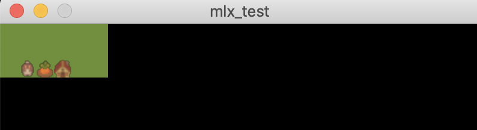
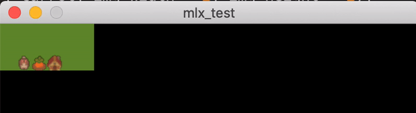

# 2022.05.13

## 과제 완료를 위해 해야 할 일

- [x] Map 읽어들이기
- [x] 에러 처리하기
  - [ ] 종료와 관련된 메모리 문제 체크 필요 (해제 함수(`mem_free`) 만들어줘야 함)
- [ ] mlx tutorial
- [ ] 이미지 창에 띄워보기
- [ ] key hook
- [ ] 동작 구현하기
- [ ] 테스트
  - [ ] map의 높이가 1인 경우, 길이가 0인 row가 있는 경우 → `get_map_size`함수에서 문제 발생 가능성 있으니 확인해보기
- [ ] (가능하다면) Bonus 중 움직임 화면에 출력하는 기능 추가
- [ ] 평가 준비하기

## mlx tutorial

내가 사용하려고 하는 opengl 파일에는 man 폴더가 없다. mms 버전의 폴더에는 man 폴더가 있길래 그 매뉴얼과 <https://github.com/terry-yes/mlx_example> 이쪽의 내용을 활용해서 공부했다.

### `man ./mlx.3`

```c
#include <mlx.h>

void *mlx_init()
```

mlx에 대한 설명... MiniLibX는 간단한 윈도우 생성, 그리기 툴, 이미지와 이벤트의 기본적인 관리를 할 수 있게 해 준다.

#### `void  *mlx_init()`

`mlx.h`는 MiniLibX API의 올바른 사용을 위해 반드시 인클루드 되어야 한다. 이 안에는 함수 프로토타입만 있고, 구조체는 없음. (지금 확인해보니까 헤더 파일 안에 주석으로 설명이 잘 되어 있다)

```c
// mlx.h

void    *mlx_init();
/*
**  needed before everything else.
**  return (void *)0 if failed
*/
```

우리가 만드려는 소프트웨어를 어떤 창을 이용하여 조작하려면 그 소프트웨어와 만드는 창 사이의 연결이 필요하다. 이 연결이 되면 이제 MiniLinb의 함수를 이용하여 메시지를 주고 받을 수 있는 것임. 그리고 `mlx_init` 이 함수를 이용하여 이 때 필요한 connection을 생성한다. 인자는 필요하지 않고 반환형은 (void *) 타입인데, 이후 MiniLibX 함수의 호출에 필요하다.

반환은 헤더파일에도 나와 있듯이 연결이 성공하면 (void *) 타입의 connection 식별자를 반환하고, 실패하면 NULL을 반환한다.

#### LINKING MiniLibX

어제 의문을 품었던 컴파일 옵션에 대한 설명도 여기 나와있었음. 매뉴얼 짱

MiniLibX 함수를 사용하기 위해서는 우리가 만들 소프트웨어와 MiniLibX 라이브러리를 포함한 여러 라이브러리를 링크해야 한다.

~~이 매뉴얼 안에 OpenGL 버전에 대한 내용도 있음 뭥미~~

다 제끼고 static OpenGL version은

```shell
-lmlx -framework OpenGL -framework AppKit -lz
```

이 arguments를 붙여서 링크를 해 줘야 한다.

### `man ./mlx_new_window.3`

```c
void *  mlx_new_window(void *mlx_ptr, int sixe_x, int size_y, char *title);

int mlx_clear_window(void *mlx_ptr, void *win_ptr);

int mlx_destroy_window(void *mlx_ptr, void *win_ptr);
```

```c
// mlx.h

/*
** Basic actions
*/

void    *mlx_new_window(void *mlx_ptr, int size_x, int size_y, char *title);
/*
**  return void *0 if failed
*/

int mlx_clear_window(void *mlx_ptr, void *win_ptr);

int mlx_destroy_window(void *mlx_ptr, void *win_ptr);
```

#### `mlx_new_window()`

새로운 창을 스크린에 생성하는 함수.

parameter 설명

- `size_x`, `size_y` : window의 크기를 결정한다.

- `title` : 윈도우의 title bar에 표시될 문자열

- `mlx_ptr` : `mlx_init()` 함수에서 반환된 connection 식별자

윈도우 생성에 성공하면 (void *) 타입의 window 식별자를 반환하고, 실패하면 NULL을 반환한다.

#### `mlx_clear_window()`, `mlx_destroy_window()`

window를 지우고 (blank 상태로 만든다.), 주어진 window를 파괴...

동일한 종류의 parameter를 갖는다.

- `mlx_ptr` : connection 식별자

- `win_ptr` : window 식별자

반환형은 void. (아무것도 반환하지 않는다.)

### `man ./mlx_pixel_put.3`

```c
int mlx_pixel_put(void *mlx_ptr, void *win_ptr, int x, int y, int color);

int mlx_string_put(void *mlx_ptr, void *win_ptr, int x, int y, int color, char *string);
```

```c
// mlx.h

int mlx_pixel_put(void *mlx_ptr, void *win_ptr, int x, int y, int color);
/*
**  origin for x & y is top left corner of the window
**  y down is positive
**  color is 0x00RRGGBB
*/

int mlx_string_put(void *mlx_ptr, void *win_ptr, int x, int y, int color, char *string);
```

#### `mlx_pixel_put()`

`win_ptr`이 가리키는 window의 특정한 ( `x`, `y` ) 지점에 `color`로 표현되는 색의 pixel을 그리는 함수.

(0, 0) 위치는 윈도우의 좌상단 코너 부분이고, `x`값이 증가하면 오른쪽으로, `y`값이 증가하면 아랫쪽으로 이동한다.

`mlx_ptr`은 역시 connecion 식별자.

window 밖의 부분은 무시한다. 그래서 `mlx_pixel_put` 함수가 느리다고 하는데... 그레서 pixel 대신 image를 사용하는 편이 좋다고 하는데 정확히 무슨 의미인지는 모르겠다.

#### `mlx_string_put()`

`mlx_pixel_put()`과 동일한 parameter를 갖지만 (`x`, `y`) 가 가리키는 지점에 픽셀 하나 대신 `string`이 출력된다는 점이 다르다.

역시 window 밖의 부분은 무시한다.

#### color management

color is 0x00RRGGBB (mlx.h 에 적힌 주석)

출력 가능한 색깔은 00|RR|GG|BB 로 표현이 되고 각각의 값은 0-255사이의 값이다.

### `man ./mlx_new_image.3`

```c
void *mlx_new_image(void *mlx_ptr, int width, int height);

char *mlx_get_data_addr(void *img_ptr, int *bits_per_pixel, int *size_line, int *endian);

int mlx_put_image_to_window(void *mlx_ptr, void *win_ptr, void *img_ptr, int x, int y);

unsigned int    mlx_get_color_value(void *mlx_ptr, int color);

void *mlx_xpm_to_image(void *mlx_ptr, char **xpm_data, int *width, int *height);

void *mlx_xpm_file_to_image(void *mlx_ptr, char *filename, int *width, int *height);

void *png_file_to_image(void *mlx_ptr, char *filename, int *width, int *height);

int mlx_destroy_image(void *mlx_ptr, void *img_ptr);
```

... 왜이렇게 많아;

~~이거 보다 보니까 여기 있는 모든 함수가 so_long에 필요한 함수는 아닌 것 같아서 일단은 필요해 보이는 함수만 정리합니다.~~

#### `mlx_put_image_to_window()`

함수 명 그대로.. 이미지를 넣을 수 있는 함수.

connection, window, image 가리키는 식별자 받아 온 다음에 (`x`, `y`) 가 가리키는 좌표에 이미지를 붙인다.

#### `mlx_xpm_file_to_image()`

xpm 파일을 사용할 수 있는 이미지로 바꾼다. (이미지를 사용할 수 있게 이미지를 메모리에 올린다는 것 같다. (`mlx_new_image` 설명 참고))

우리는 **파일**을 가지고 있을 것이기 때문에 xpm_file, png_file 함수를 써야 할 것 같은데 왜 많은 분들이 (사실 본 분 들의 100%가) xpm 파일을 사용하는지 모르겠다... 내가 아직 이미지를 안올려봐서 그런듯

#### `mlx_destroy_image()`

이미지를 삭제한다.

#### 반환값

이미지를 생성해내는 함수들 (`mlx_new_image()`, `mlx_xpm_to_image()`, `mlx_xpm_file_to_image()`, `mlx_png_file_to_image()`) 은 생성에 성공했을 때에는 그 이미지를 가리키는 (void *) 타입의 식별자를 반환하고, 실패한 경우에는 NULL을 반환한다.

### `man .mlx_loop.3`

```c
int mlx_loop(void *mlx_ptr);

int mlx_key_hook(void *win_ptr, int (*funct_ptr)(), void *pram);

int mlx_mouse_hook(void *win_ptr, int (*funct_ptr)(), void *pram);
```

~~역시 일단 필요해보이는 것만 정리해보기~~

#### `mlx_loop()`

이벤트를 받기 위해서는 `mlx_loop()` 을 반드시 사용해야 한다. 이 함수는 **절대** 반환하지 않는다. 이벤트를 기다리면서 무한으로 반복하고 있다가, 이벤트가 발생하면 유저가 지정해둔 함수를 호출한다.

#### `mlx_key_hook()`, `mlx_mouse_hook()`

- `funct_ptr`은 이벤트가 발생하면 호출할 함수의 포인터

- `param`은 이제 함수가 호출되면 그 함수에 전달될 parameter

... 이거 열심히 보고 있는데 `mlx_hook()` 함수가 더 좋아서 이거 안쓴다는 얘기를 봐 버렸다. 근데 매뉴얼에 없음... ~~이왜진~~

### `mlx_hook()`

```c
// mlx.h

int mlx_hook(void *win_ptr, int x_event, int x_mask, int (*funct)(), void *param);
```

참고

- <https://harm-smits.github.io/42docs/libs/minilibx/events.html>

- <https://yeosong1.github.io/miniRT%EB%9D%BC%EC%9D%B4%EB%B8%8C%EB%9F%AC%EB%A6%AC>

- <https://velog.io/@sham/solong-mlx-%EB%9D%BC%EC%9D%B4%EB%B8%8C%EB%9F%AC%EB%A6%AC>

parameter 설명

- `win_ptr`: window 식별자

- `x_event` : hook 할 이벤트들을 가리키는... 번호?
  - 3 : key up -> `mlx_key_hook`과 동일
  - 4 : mouse down -> `mlx_mouse_hook`과 동일

- `x_mask` : 말그대로 마스킹을 할 수 있다는 것 같은데 [여기](https://harm-smits.github.io/42docs/libs/minilibx/events.html#macos-version)서 보면 MaxOS에서는 지원하지 않기 때문에 0을 넣어줘야 한다고 합니다.

이정도면 얼추 공부는 한 것 같다. 일단 내가 사용하려고 했던 이미지들을 한번 띄워 봅시다.

## 이미지 창에 띄워보기

이미지는 <https://shubibubi.itch.io/cozy-farm> 여기서 ~~샀다~~. 바보... 통과 못하고 블랙홀 빠져버리면 진짜 큰일나

이미지 띄워보던 중에 발견한 사실 : `mlx_png_file_to_image()` 는 메모리 누수를 발생시킨다고 한다. 출처: <https://42kchoi.tistory.com/229>

근데 메모리 누수도 문제지만 컴파일 시에 `mlx_png_file_to_image()` 이 함수를 못 찾고 `mlx_xpm_file_to_image` 아니냐고 묻는데... 피곤하다 일단 그냥 xpm으로 변환해서 씁시다.



이게 맞나 싶지만... 일단 이미지 띄우긴 성공했다.

이미지 띄우고 나니까 생각한건데 이거 맵의 크기 제한이 없어가지고... 이미지 하나의 크기? 아니면 윈도우의 크기 지정하는 것을 좀 생각을 해 봐야 할 것 같다. 어지럽네

그리고 이미지를 겹치는 것 또한 가능하다는 것. 하하 수집품 하나 없어질 때마다 타일 삭제, 생성 반복해야 할 줄 알았는데 그냥 수집품 이미지만 없애버리면... 아니 이거 생성 삭제 가능한가?ㅋㅋㅋㅜㅜ

## key hook

참고

- <https://velog.io/@jeunghoon/MiniLibX%EB%A5%BC-%EC%9D%B4%EC%9A%A9%ED%95%B4-%ED%82%A4%EB%A5%BC-%EC%9E%85%EB%A0%A5-%EB%B0%9B%EC%95%84-%EB%B3%B4%EC%9E%90>

- <https://github.com/VBrazhnik/FdF/wiki/How-to-handle-mouse-buttons-and-key-presses%3F>

- <https://gist.github.com/jfortin42/68a1fcbf7738a1819eb4b2eef298f4f8>

위의 저 허접한 맵에서 <kbd>W</kbd> 누르면 당근이 사라지고, <kbd>A</kbd> 누르면 당근이 다시 나타나게 해 봅시다. (일단 생겼다 지웠다 하는걸 잘 모르겠어서 걍 덮어쓰게 만들예정)



하찮은 당근이 있었는데 없고 다시 생겼다 다시 사라진다. (좀 귀여운 것 같다)

대충 이벤트를 이용하는 방법은 알겠는데 이제 문제는 계속 이미지를 **덮어쓰는**게 맞는지, 그리고 이미지 크기 조정이라던가... 주어지는 맵의 크기에 따른 이미지 크기 조정? 이런 것들을 좀 고민해봐야 할 것 같다.

오늘 노트가 너무 길어져서 다음 노트에 적어야겠다. (m1에서 돌리는 방법도 알았고 집에 가서 마저 할 예정. 과연 14일에 평가를 받을 수 있을 것인가....)

## 과제 완료를 위해 해야 할 일 (Update)

- [x] Map 읽어들이기
- [x] 에러 처리하기
  - [ ] 종료와 관련된 메모리 문제 체크 필요 (해제 함수(`mem_free`) 만들어줘야 함)
- [x] mlx tutorial
- [x] 이미지 창에 띄워보기
- [x] key hook
- [ ] 맵 그리기
- [ ] 동작 구현하기
- [ ] 테스트
  - [ ] map의 높이가 1인 경우, 길이가 0인 row가 있는 경우 → `get_map_size`함수에서 문제 발생 가능성 있으니 확인해보기
- [ ] 평가 준비하기

