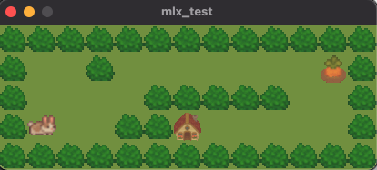
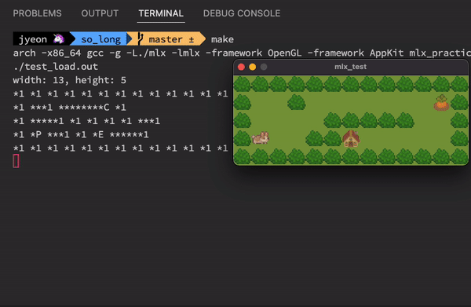

# 2022.05.14

## 과제 완료를 위해 해야 할 일

- [x] Map 읽어들이기
- [x] 에러 처리하기
  - [ ] 종료와 관련된 메모리 문제 체크 필요 (해제 함수(`mem_free`) 만들어줘야 함)
- [x] mlx tutorial
- [x] 이미지 창에 띄워보기
- [x] key hook
- [ ] 맵 그리기
- [ ] 동작 구현하기
- [ ] 테스트
  - [ ] map의 높이가 1인 경우, 길이가 0인 row가 있는 경우 → `get_map_size`함수에서 문제 발생 가능성 있으니 확인해보기
- [ ] 평가 준비하기

## 맵 그리기

일단 이미지 자체 크기가 너무 작아서 리사이징을 했다 (32 * 32px)

세그폴트가 일어나서 엄청 당황했다. 이유는 놀랍게도 불러오는 이미지 이름을 잘못 써서;;; mlx 라이브러리 내에서 세그폴트가 발생한 것이었다. ㅜㅜ

그 외에 x 좌표 y 좌표 헷갈려서 엉망으로 출력된 것을 고치고 나서야



귀여운 맵을 그릴 수 있었다 코드 정리는 좀 필요할 듯... 엉망이다.

## 동작 구현하기

### 0. 해야 할 것들

- **player의 동작마다 그 수를 세어서 출력하기.** 만약에 벽에 막혀서 움직이지 못하는 상황이라면 당연히 움직인 것이 아니므로 (movement가 아님) 동작의 수를 올리지 않고, 출력하지도 않는다.
- <kbd>ESC</kbd>를 누르면 **window가 닫히고, Program이 깨끗하게 종료되어야 한다.**
- 상단바의 빨간버튼을 마우스로 클릭하면 **window가 닫히고, Program이 깨끗하게 종료되어야 한다.**
- <kbd>W</kbd>, <kbd>A</kbd>, <kbd>S</kbd>, <kbd>D</kbd> 로 player를 움직인다. (서브젝트에는 딱히 정확한 언급이 없긴 하지만, 통상적인 사용법대로 각각 up, left, down, right 쪽으로 움직이는 것으로 함.) 
- 당근을 먹으면 당근 이미지 위에 background 덮어씌우기
- E에 도착하면 .. 프로그램을 종료하거나, 아니면 성공 메세지 띄우거나... 이미지를 띄우거나 (고민중)

### 1. W, A, S, D로 player 움직이기 + 동작 수 세어서 출력해주기

플레이어 정보를 저장하기 위한 구조체를 만들었다.

```c
// so_long.h

typedef struct s_player	t_player;
struct s_player
{
	int pos_x;
	int pos_y;
	int dir;
	int	mov_cnt;
};
```

이 값들은 가장 처음에 map을 그릴 때 'P'를 만나게 되면 초깃값으로 초기화 된다.

그리고 움직임에 맞춰서 이미지를 덮어씌워주면서 상황에 맞는 이미지를 만들어주었다.

그렇게 완성을 했는데... (스크린샷에 보이는 출력된 이상한 문자들은 디버깅용으로 출력한 문자들이다.)



생각보다 더 귀엽다... 분명 서브젝트에서 욕심 내지 말라고 했는데 욕심이 난다...

### 2. 강제종료 구현하기 (ESC, 빨간버튼 클릭)

정상종료 함수 구현 (`normal_exit`) 그리고 마우스 클릭에 대한 event를 걸어주면 되겠다.

## 과제 완료를 위해 해야 할 일 (Update)

- [x] Map 읽어들이기
- [x] 에러 처리하기
  - [ ] 종료와 관련된 메모리 문제 체크 필요 (해제 함수(`mem_free`) 만들어줘야 함)
  - [ ] map 파일이 반드시 *.ber 포맷이어야 한다
  - [ ] 에러 출력하는 부분 다시 확인. (함수 공부하기 `perror`, `strerror`)
- [x] mlx tutorial
- [x] 이미지 창에 띄워보기
- [x] key hook
- [x] 맵 그리기
- [ ] 동작 구현하기
  - [x] Player 동작 세어주고, 터미널에 계속 출력하기
  - [ ] ESC, 빨간 버튼 마우스 클릭, W, A, S, D key 동작 설정하기
  - [ ] C에 도착했을 때 

- [ ] 테스트
  - [ ] map의 높이가 1인 경우, 길이가 0인 row가 있는 경우 → `get_map_size`함수에서 문제 발생 가능성 있으니 확인해보기
- [ ] 평가 준비하기

