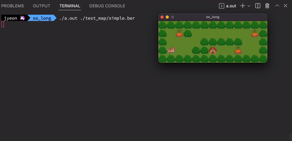
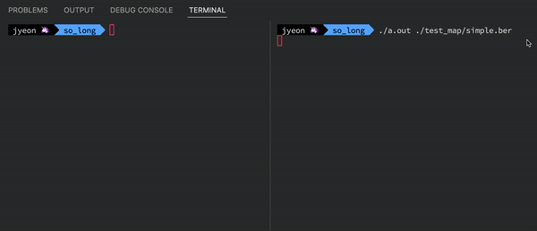
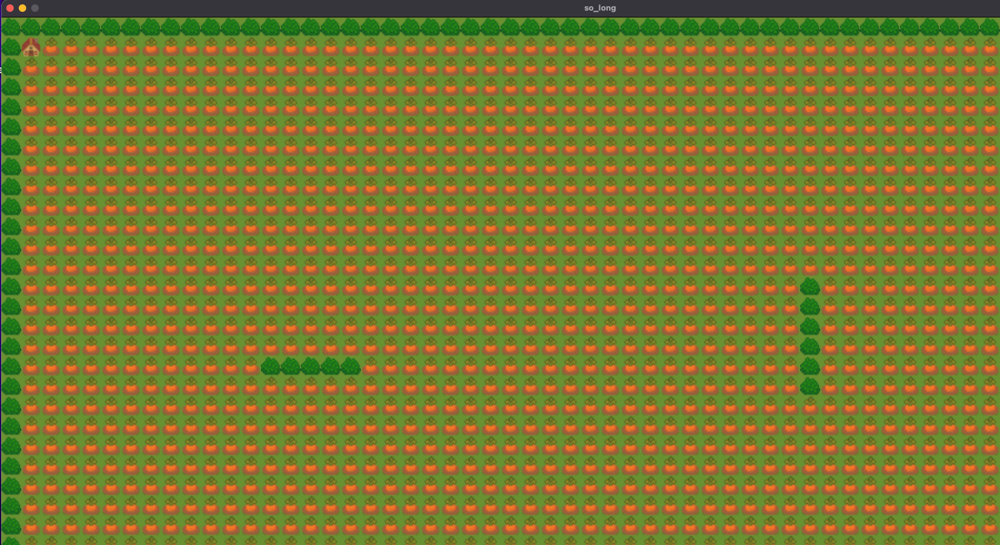

# 2022.05.15

## 과제 완료를 위해 해야 할 일

- [x] Map 읽어들이기
- [x] 에러 처리하기
  - [ ] 종료와 관련된 메모리 문제 체크 필요 (해제 함수(`mem_free`) 만들어줘야 함)
  - [ ] map 파일이 반드시 *.ber 포맷이어야 한다
  - [ ] 에러 출력하는 부분 다시 확인. (함수 공부하기 `perror`, `strerror`)
- [x] mlx tutorial
- [x] 이미지 창에 띄워보기
- [x] key hook
- [x] 맵 그리기
- [ ] 동작 구현하기
  - [x] Player 동작 세어주고, 터미널에 계속 출력하기
  - [ ] ESC, 빨간 버튼 마우스 클릭, W, A, S, D key 동작 설정하기
  - [ ] C에 도착했을 때 (당근을 다 모은 경우 / 다 모으지 않은 경우)
  - [x] 자잘한 에러 상황 정리하기
- [ ] 테스트
  - [ ] map의 높이가 1인 경우, 길이가 0인 row가 있는 경우 → `get_map_size`함수에서 문제 발생 가능성 있으니 확인해보기
- [ ] 평가 준비하기

---

놀랍게도 15일 점심에 평가 받는게 목표였다. 이렇게 복잡할줄이야..!

## 동작 구현하기

기쁜 소식과 슬픈 소식이 있다.

기쁜 소식은 일단 움직임 구현은 완료했다는 점 (이번엔 진짜다)

근데 엄청 슬픈 소식은... 이미지가 사라진다. 그것도 "가끔"

다들 이 과제 쉽다고 하던데 나는 왜 이렇게 어려울까...

그래서 일단 이렇게 구현한 것 ~~킵해두고~~, 매번 맵 상에서 P의 위치를 바꿔가면서 출력하는 방식으로... 다시 만들었다.

생각해보니까 서브젝트에서 우선시하는 부분이 안정적으로 동작해야 한다! 였기 때문에 어찌 되었든 안정적으로 동작하기만 하면 되지 않나 하는 생각이 들었다. 그렇게 따지면 매번 맵을 재출력하는 편이 훨씬 안정적이다. 그냥 이 방법을 주력으로 해야 겠다.

그래서... 함수 정리 완료 했고, 구현도 완료 했다.

gif라 구분이 좀 어렵긴 하지만 순서대로 당근먹기, 당근 덜먹고 E접근 시도, 다 먹고 E 접근 / 종료버튼으로 종료 / ESC 버튼으로 종료 기록이다.

솔직히 눈물 찔끔 났다. 자고 싶지만 파일 정리, 메모리 해제가 남았다. 아좌좌좌좌

## 평가 준비하기

1. map의 최댓값?

   int 범위 내라면 일단 출력이 가능하게 만들었다.

   최댓값의 범위가 주어지지 않아서 (이미지 사이즈 (32) * 맵 높이) 랑 (이미지 사이즈 (32) * 맵 높이)의 범위가 int 범위 안에만 있으면 어쨌든 화면 출력이 되게 만들어 주었다.

   창을 만드는 `mlx_new_window` 함수의 인자 중에서 사이즈를 결정하는 인자가 int 형이기도 하고... 함수들에서 사이즈를 다룰 때 모두 int를 사용하기 때문에 일단 총 길이 자체가 int를 벗어나는 경우는 생각하지 않아도 될 것 같았다.

   그리고 엄청 큰 맵을 출력하는 경우에 실제 화면의 크기보다 큰 맵이 출력되는데 창캡쳐해보면 다 출력된게 보이지만 화면 상에서는 잘려서 보인다 (아래 스크린샷에 보면 우하단 부분이 잘려 있음)

   

   맵을 입력하는 것은 사용자이니만큼 플레이 가능한 맵인지의 여부도 사용자가 판단해야 한다고 생각해서 (일단 경로가 있는 맵인지 여부는 사용자의 판단에 맡기라고 서브젝트에 되어 있음) 가능하면 다 출력은 하되 플레이는... 창을 옮겨가면서 하던가... 아무래도 어렵겠지요?

   사실 이미지 사이즈를 조정해서 화면의 해상도를 받아와서 개수만큼 나누는 방법을 사용할 수 있다면 가장 최고겠지만 나의 지식으로는 여기서 다룰 수 있는 `mlx_put_image_to_window`, `mlx_xpm_file_to_image` 함수에서는 이미지의 크기를 조정하는 방법이 없는 것으로 알고 있다. 픽셀을 찍는다면... 찍어야겠지만 서브젝트에서 "이미지"를 사용하는 것을 적극 추천한다고 했음.

   그렇다고? 화면 크기를 mlx로 받아와서, 예상되는 출력 창의 크기가 화면 크기보다 클 경우에는 에러를 발생하는 방법은... 내 기준으로는 좀 맞지 않다고 생각한다. 일단 서브젝트에서 주어지는 조건에 맞는 맵은 일단 다 파싱을 하라고 했으므로 ㅇㅇ 일단은 최대한 파싱을 해줘야 한다고 생각.. 했다. 

   맨날 평가 직전에 엄청 보수적으로 질문거리를 생각하게 되는데 막상 이런 질문 한번도 받아 본 적 없음... 내가 평가할 때 이거 질문해봐야겠다 크크

## error 출력 함수

나는 그냥 printf로 출력해주긴 했지만 프로젝트에서는 에러 출력을 위한 함수인 `perror` 랑 `strerror` 함수를 허용함수로 두고 있다.

사실 잘 몰라서 안쓴거라.. 공부해보았다.

참고

- <https://www.ibm.com/docs/ko/i/7.3?topic=functions-perror-print-error-message>
- <https://www.ibm.com/docs/ko/i/7.3?topic=functions-strerror-set-pointer-runtime-error-message#strerro>

`perror` 는 에러 출력 함수이다. errno값을 확인해서 시스템 에러를 출력해준 뒤에 사용자 정의 문자열도 같이 붙여넣을 수 있다.

`strerror` 오류 메시지 문자열에 대한 포인터를 반환하는 함수. 그러니까 `strerror`랑 `printf`를 적절하게 사용하면 `perror` 를 만들 수 있겠다.

이 함수들에 대해 알게 되었어도 그냥 printf로 에러 출력을 하기로 마음먹은 것은 이 서브젝트에서 말하는 "오류"가 시스템적으로 문제가 되는 오류도 있지만, 시스템적으로 전혀 문제는 되지 않지만 서브젝트의 기준으로 문제가 되는 경우도 있기 때문에 (맵 내 문자 관련한 오류라던가, 사각형이 아니라는 오류?) errno를 이용해서 굳이 에러관리를 하는게 편하지는 않을 것 같았다. 명확한 에러 메시지를 출력하라는 서브젝트의 요구에도 맞지 않을 것 같았고. ... 뭐 사용자 정의 errno를 정의해서 하면 되지 않느냐!! 하면 할말은 없지만 굳이...? 라는 생각이 든다.

## 과제 완료를 위해 해야 할 일 (Update)

- [x] Map 읽어들이기
- [x] 에러 처리하기
- [x] mlx tutorial
- [x] 이미지 창에 띄워보기
- [x] key hook
- [x] 맵 그리기
- [x] 동작 구현하기
- [x] 테스트ß
- [x] 평가 준비하기
